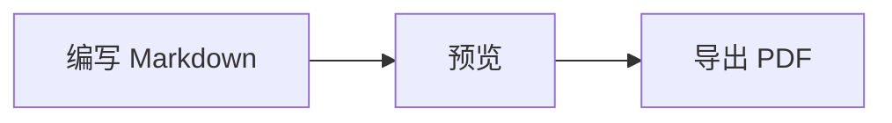

# Markdown 简明教程

Markdown 是一种轻量级标记语言。它使用少量符号表示标题、列表、链接等排版结构，源文件通常以 `.md` 结尾。它具有易读、易写、方便版本管理等特点，常用于技术博客、项目文档、实验报告和 AI 提示词。

## 1. Markdown 基础语法

### 标题

使用 `#` 表示标题，数量代表标题级别：

```markdown
# 一级标题
## 二级标题
### 三级标题
```

### 列表

无序列表：

```markdown
- Linux
- Python
- 网络安全
```

有序列表：

```markdown
1. 安装工具
2. 编写文档
3. 导出 PDF
```

任务列表：

```markdown
- [x] 学习基础语法
- [ ] 学习高级用法
```

### 强调与引用

```markdown
**粗体**
*斜体*
~~删除线~~

> 这是一段引用。
```

### 链接和图片

```markdown
[OpenAI](https://openai.com)


```

建议把作业图片放入项目的 `images` 目录，避免使用只在自己电脑上有效的临时路径。

### 表格

```markdown
| 工具 | 类型 | 特点 |
|---|---|---|
| StackEdit | 在线 | 无需安装 |
| VS Code | 本地 | 插件丰富 |
```

### 代码

行内代码：

```markdown
使用 `ls -l` 查看文件。
```

代码块：

````markdown
```python
print("Hello, Markdown!")
```
````

指定语言后，支持的平台会进行语法高亮。

## 2. Markdown 工具推荐

在线工具：

- [StackEdit](https://stackedit.io/)：支持实时预览、数学公式和云端同步。
- [Dillinger](https://dillinger.io/)：界面简洁，支持导入和导出。

本地工具：

- [Visual Studio Code](https://code.visualstudio.com/)：免费、插件丰富，适合同时编写文档与代码。
- [Typora](https://typora.io/)：所见即所得，适合专注写作，但正式版通常需要付费。

此外，Obsidian 适合构建个人知识库。

## 3. Markdown 高级用法

### 数学公式

许多平台使用 LaTeX 语法表示公式：

```markdown
行内公式：$E=mc^2$

独立公式：

$$
H(X)=-\sum_{i=1}^{n}p_i\log_2p_i
$$
```

公式能否正常显示取决于平台是否支持 MathJax 或 KaTeX。

### Mermaid 绘图

````markdown

````

Mermaid 还可以绘制时序图、状态图和类图，但并非所有博客平台都原生支持。

### 制作 PPT

可以使用 Marp，通过 Markdown 的 `---` 分隔幻灯片：

```markdown
---
marp: true
---

# Markdown 学习汇报

---

## 高级功能

- 数学公式
- Mermaid 绘图
- 格式转换
```

安装相应的 VS Code 插件后，可以预览并导出 PDF 或 PPTX。

### 格式转换

Pandoc 可以将 Markdown 转换成其他格式：

```bash
pandoc report.md -o report.pdf
pandoc report.md -o report.docx
pandoc report.md -o report.html
```

转换 PDF 时通常还需要安装 LaTeX 或使用其他 PDF 引擎。不同 Markdown 工具的扩展语法并不完全一致，转换后应检查公式、表格和图片。

## 4. Markdown 在 AIGC 提示词中的应用

Markdown 可以清楚地区分角色、背景、任务、输入材料和输出要求，减少 AI 对提示词的误解。例如：

```markdown
# 角色

你是一名 Linux 内核教师。

# 背景

我正在学习系统调用，但不理解用户态如何进入内核态。

# 任务

1. 用通俗语言解释系统调用。
2. 给出一个 Linux 示例。
3. 一次向我提出一个检查理解的问题。

# 输出要求

- 使用 Markdown；
- 不超过 800 字；
- 代码必须添加注释；
- 不确定的内容要明确说明。
```

在提示词中使用标题、列表、表格和代码块，可以划分信息层次；使用代码块包围原始材料，还能减少“材料内容”和“任务指令”混淆。

需要注意，Markdown 只是组织提示词的方法，真正决定回答质量的仍是明确的上下文、具体任务、必要约束和可检查的输出标准。
