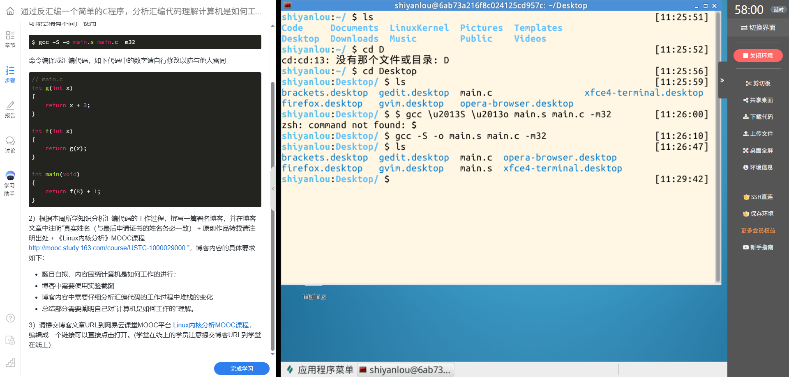

# 2026《Linux内核原理与分析》第2周作业

> 作者：叶丁再
> 课程：《Linux内核原理与分析》  
> 转载说明：原创内容如被转载，请注明原文出处。

## 一、实验想回答的问题

写 C 程序时，函数调用看起来只是把参数交给另一个函数，再接收返回值。编译器把 C 代码转换成汇编后，调用需要保存哪些信息？参数在哪里？函数如何返回？这次实验通过一个简单的 32 位程序观察 C 代码到汇编文本的转换，并借函数调用分析栈帧如何建立和恢复。

## 二、程序结构与计算关系

课程题面给出的参考程序如下。题目要求自行修改数字；本次提供的终端截图没有显示 main.c 的内容，因此发布前请把代码替换成自己实际编写的版本，并按实际常数更新结果。

```c
int g(int x)
{
    return x + 3;
}

int f(int x)
{
    return g(x);
}

int main(void)
{
    return f(8) + 1;
}
```

对这份参考代码而言，g 函数给参数加上常数 3，f 函数把参数传给 g 并返回结果，main 函数调用 f 后再加 1。因此参考示例的返回值为 8 + 3 + 1 = 12。若将程序中三个数字记为 C、N、M，计算关系就是：

**g(x) = x + C；f(x) = g(x)；main 返回 N + C + M。**

这段程序没有调用 printf，所以运行时不会把结果打印出来。若将源文件编译并运行，main 的返回值会成为进程退出状态；它与终端直接显示结果不是一回事。

## 三、生成汇编文件的实验记录

我在 Linux 实验桌面进入保存 main.c 的目录，执行了：

```bash
gcc -S -o main.s main.c -m32
```

其中，-S 表示编译到汇编文本后停止；-o main.s 指定汇编文件名；-m32 要求 GCC 生成 32 位目标代码。该命令生成 main.s，但不会把它汇编、链接成可执行文件，也不会运行程序。

截图记录了第一次尝试时 zsh 报出 command not found: $；随后在提示符下直接输入 gcc -S -o main.s main.c -m32，命令执行后终端返回提示符，再运行 ls 时列表中出现 main.s。这个结果证明汇编文件已生成。



*图 1：终端记录显示正确的 GCC 命令执行成功，并在目录列表中出现 main.s。截图没有展示 main.s 的具体汇编内容，也没有展示调试器中的运行时栈。*

## 四、从 C 函数调用到汇编操作

gcc -S 经过编译器前端和代码生成阶段，把 C 程序转换成目标架构的汇编指令。-m32 让生成结果面向 32 位 x86。通常 GCC 输出采用 AT&T 语法：寄存器名前有百分号，立即数前有美元符号，指令操作数多按“源、目标”的顺序书写。

我目前能从源程序确定的是调用关系。由于截图没有打开 main.s，下面按常见的 32 位 x86 调用形态解释指令职责，不把它冒充为本次编译器逐字生成的汇编清单。

| C 程序中的动作 | 汇编中常见的操作 | 作用 |
|---|---|---|
| main 准备参数并调用 f | 把参数放到栈上，然后执行 call f | 保存返回位置，并转到 f 执行 |
| f 把参数传给 g | 传递参数，然后执行 call g | 建立第二层函数调用 |
| g 计算 x + C | 从参数位置取值，执行加法 | 计算结果通常放入 EAX |
| g 或 f 返回 | 执行 ret | 从栈中取出返回地址，回到调用者 |
| main 加上常数 M | 对返回寄存器中的值执行加法 | 得到 main 的最终返回值 |

汇编中常见的 push、call、ret、mov、add 分别用于压栈、调用、返回、数据传送和算术运算。编译器版本、优化选项和是否保留帧指针都会影响指令排列，所以精确解释时应以自己生成的 main.s 为准。

## 五、函数调用期间栈的变化

本实验使用 -m32，以下按常见的 32 位 Linux x86 cdecl 调用约定解释。栈向较低的内存地址增长，ESP 指向当前栈顶。一次 32 位 push 或 call 通常使 ESP 减少 4 字节，并在新的栈顶保存一个 4 字节值。

### 1. main 调用 f

main 准备整数参数 N 后调用 f。常见实现会先将参数压栈，再执行 call。执行 call 时，CPU 把 call 后一条指令的地址压入栈中作为返回地址，然后跳到 f。此时 f 可以从栈中找到参数和返回位置。

### 2. f 建立自己的栈帧并调用 g

在保留帧指针的典型函数序言中，f 会保存调用者的 EBP，再把当前 ESP 作为新的 EBP。此后，参数、返回地址和局部空间相对 EBP 的位置通常如下：

```text
较高内存地址
[EBP + 8]   第一个参数 x
[EBP + 4]   返回到调用者的地址
[EBP]       调用者保存的 EBP
[EBP - ...] 局部变量或临时空间（如有）
较低内存地址
ESP 附近为当前栈顶
```

f 随后将自己的参数传给 g，再执行 call g。这个调用会再保存一个返回地址；g 建立栈帧后，栈顶继续向较低地址移动。嵌套调用因此在栈上形成多层记录，每层记录对应一个尚未完成的函数调用。

### 3. g 计算并返回

g 从参数位置读出 x，计算 x + C。按照常见的 32 位整数返回规则，结果放入 EAX。函数恢复自己的栈帧并执行 ret；ret 从栈顶取出先前保存的返回地址，程序便回到 f 中 call g 之后的位置。

### 4. f 返回给 main

f 得到 g 的结果后将其返回。f 的栈帧被恢复，ret 让程序回到 main。cdecl 通常由调用方清理参数占用的栈空间。最后 main 使用 EAX 中的返回值再加上常数 M，并将结果交还给启动代码。

概括这一过程，栈保存了嵌套函数继续执行所需的信息：参数、返回地址、旧的帧指针，以及可能存在的局部变量。函数逐层返回时，这些栈帧也逐层恢复。实际编译器可能省略帧指针、调整栈空间或采用不同指令，但函数调用与返回所需的信息仍须得到保存和恢复。

### 5. 观察边界与补充验证

当前截图可以确认 main.s 已生成，但没有显示其中的具体指令；我也没有拿到 ESP、EBP 或栈内存的运行时读数。因此本节解释的是依据 32 位调用约定对栈变化的分析，不能写成已经逐条观察到的 GDB 结果。

若要把实际汇编行与上述过程逐一对应，可在实验环境打开 main.s 并截图。若要记录运行时栈，可以在具备 32 位链接支持的环境中编译带调试信息的可执行程序，然后在 GDB 中于 main、f、g 处设置断点，单步观察指令，并记录 EIP、ESP、EBP、EAX 及栈顶内存。实际数值应以新采集的输出为准。

## 六、我对“计算机是如何工作的”的理解

通过这个例子，我对程序运行的理解从“函数调用会得到一个结果”变成了一条更具体的过程：编译器把 C 语句转换成处理器指令；CPU 按指令地址取指、译码和执行；寄存器保存当前计算和控制流所需的值；栈保存函数参数、返回位置和临时状态。调用函数时，控制流跳转并留下返回位置；函数完成后，处理器利用返回地址继续执行调用者的指令。

这次实验也让我认识到，源代码中的一行函数调用会对应多项底层工作。汇编文件展示了编译器生成的指令，栈帧则说明这些指令如何保存和恢复调用现场。要真正解释自己的程序，还需要把自己修改后的 C 代码、实际生成的 main.s 和调试器观察到的状态放在一起核对。