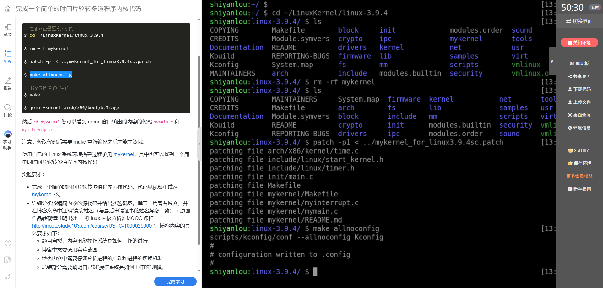
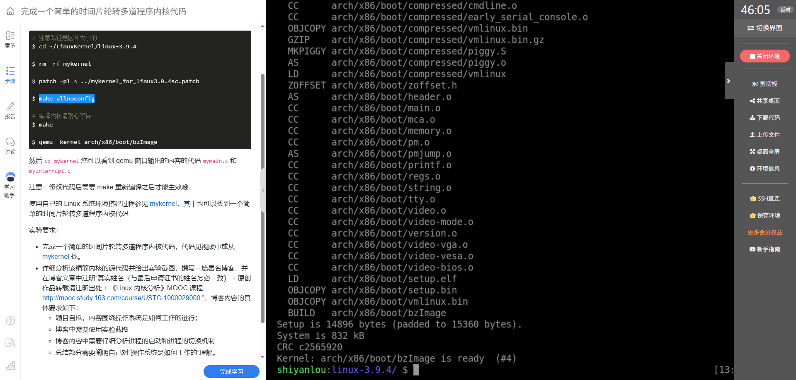
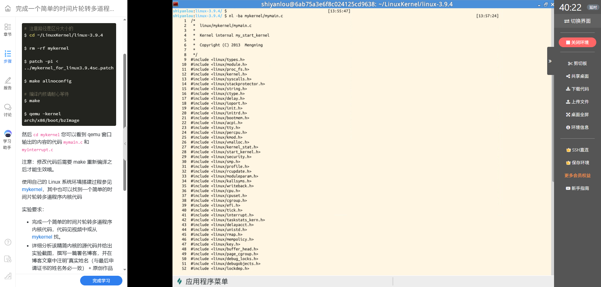
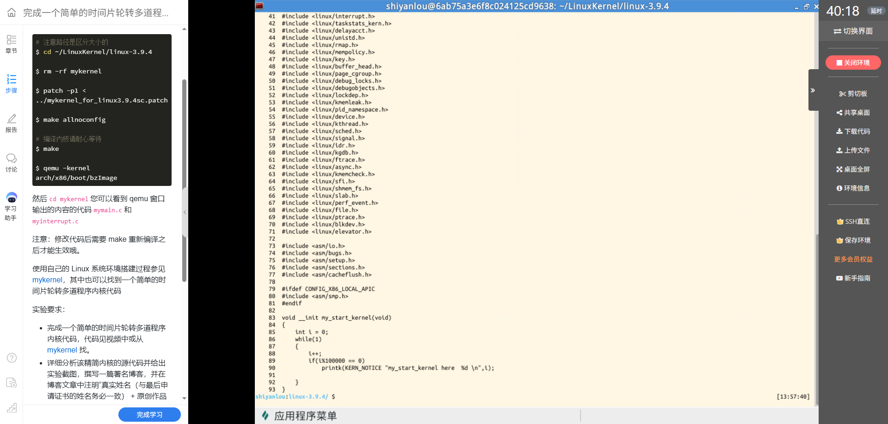
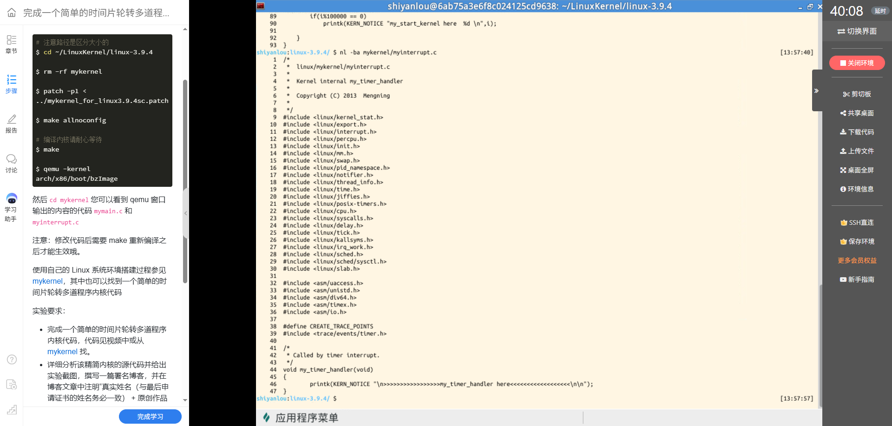
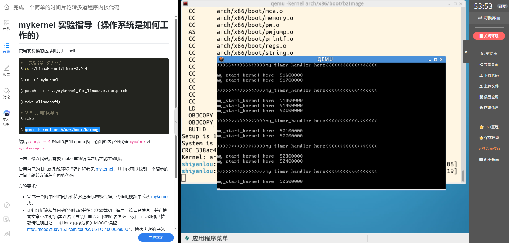

# 从定时器中断到内核输出：mykernel 实验分析

**课程：**《Linux内核原理与分析》  
**姓名：**叶丁再  
**学号：**20262809

## 一、实验目标

本次实验围绕课程给出的 `mykernel` 代码展开。实验要求是完成一个简单的时间片轮转多道程序内核，并结合源码与实验现象分析程序启动和切换机制。本文先记录当前截图能够证明的环境搭建、源码结构和运行输出，再区分已经观察到的现象与仍需进一步验证的调度行为。

## 二、实验环境与操作过程

实验在实验楼提供的 Linux 环境中进行，内核源码目录为 `~/LinuxKernel/linux-3.9.4`。课程操作流程如下：

```bash
cd ~/LinuxKernel/linux-3.9.4
rm -rf mykernel
patch -p1 < ../mykernel_for_linux3.9.4sc.patch
make allnoconfig
make
qemu -kernel arch/x86/boot/bzImage
```

其中，`patch -p1` 将课程补丁应用到 Linux 3.9.4 源码树；`make allnoconfig` 生成最小化配置；`make` 编译内核；最后由 QEMU 启动生成的 `bzImage`。截图记录了补丁文件写入 `mykernel` 等路径、配置文件生成，以及 `arch/x86/boot/bzImage is ready (#4)` 的构建结果。



*图1 补丁应用并生成内核配置。*



*图2 内核镜像构建完成。*

## 三、`mykernel` 中两份代码的作用

`mykernel` 是补丁加入 Linux 源码树的教学代码目录。它不是 QEMU 单独加载的程序；补丁把其中的函数接入内核相关流程，编译后代码包含在 `bzImage` 中，QEMU 执行的是这个内核镜像。

### 1. `mymain.c`：启动后的循环输出

源码定义了 `my_start_kernel()`。函数初始化计数变量 `i`，然后进入 `while(1)` 循环，不断递增 `i`；每当 `i` 是 100000 的整数倍时，通过 `printk()` 输出 `my_start_kernel here` 和当前计数值。





*图3 `mymain.c` 中 `my_start_kernel()` 的完整实现。*

### 2. `myinterrupt.c`：定时器处理日志

源码定义了 `my_timer_handler()`，函数体通过 `printk()` 输出 `my_timer_handler here`。课程补丁将该处理函数接入定时器中断路径，因此 QEMU 运行时可以看到这条日志。



*图4 `myinterrupt.c` 中 `my_timer_handler()` 的实现。*

## 四、QEMU 运行现象与分析

QEMU 输出截图中可以看到 `my_start_kernel here` 的计数日志，也能看到 `my_timer_handler here`。前者与 `mymain.c` 中的格式字符串相对应，后者与 `myinterrupt.c` 中的格式字符串相对应。结合源码和运行画面，可以确认这两个输出点在实验运行时产生了日志；定时器处理函数也确实被调用。



*图5 QEMU 中出现定时器处理日志与循环计数日志。*

需要区分的是，定时器处理函数被调用，不等于已经从当前源码截图证明了任务轮转。当前展示的 `my_timer_handler()` 函数体只有日志输出；`my_start_kernel()` 展示的是单个循环计数逻辑。这些代码与日志本身没有展示多个任务的选择过程，也没有展示寄存器、栈或执行上下文的保存与恢复。因此，现有截图可以证明补丁构建和相关日志运行，不足以单独证明调度器完成了任务切换。

## 五、对“计算机是如何工作的”的理解

这次实验让我看到，计算机的运行过程可以沿着“源码—内核构建—内核镜像—处理器执行—日志输出”逐步追踪。源码里的 `printk()` 提供了可识别的观察点；补丁建立代码与内核流程之间的连接；编译器和链接器把修改后的代码纳入内核镜像；QEMU 再模拟计算机环境运行它。通过将日志与源代码逐项对应，可以解释某条输出来自哪里，以及什么执行路径触发了它。

同时，观察到一次中断或一条处理函数日志，只能说明对应路径运行过。要说明时间片轮转，还需要找到任务队列或任务状态、调度决策，以及切换上下文的代码，并用不同任务交替执行的现象加以印证。把“看到了什么”和“据此能推出什么”分开，是分析操作系统行为的重要方法。

## 六、课程来源

本实验依据《Linux内核原理与分析》MOOC 课程实验指导。课程要求转载注明出处：

> 原创作品转载请注明出处 +《Linux内核分析》MOOC 课程：<http://mooc.study.163.com/course/USTC-1000029000>

---

**作者：**叶丁再（20262809）
