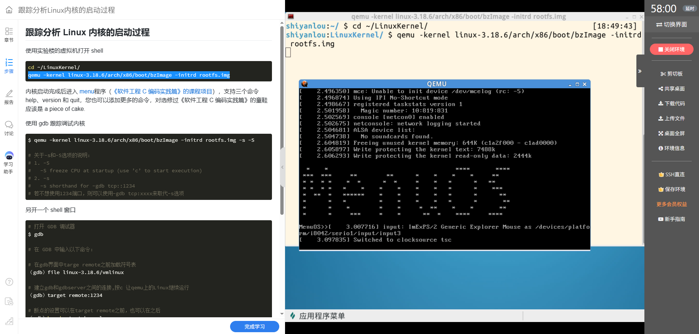
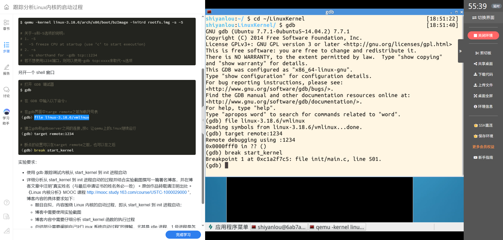
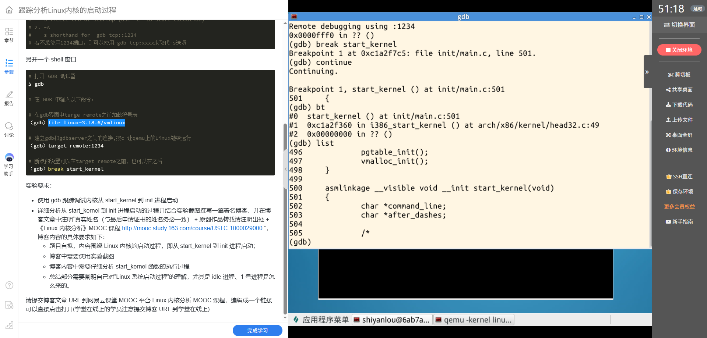
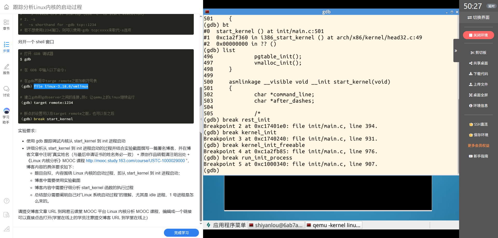
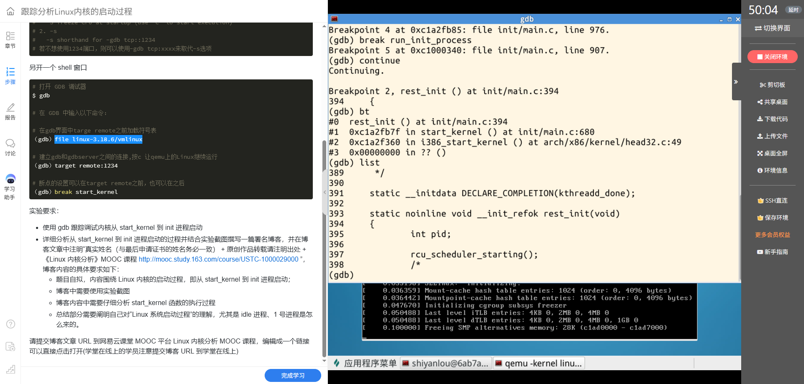
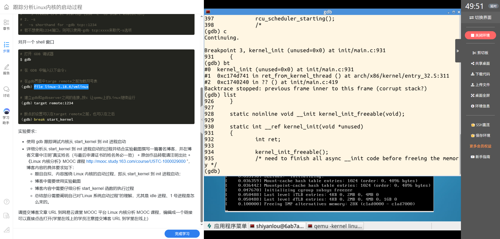
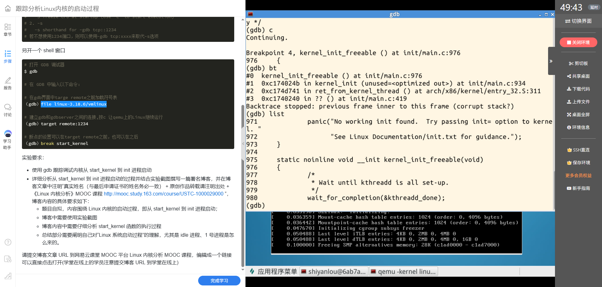

# 从 start_kernel 到 /init：Linux 3.18.6 内核启动跟踪

**课程：**《Linux内核原理与分析》  
**姓名：**叶丁再  
**学号：**20262809

## 一、实验目标与调试方式

本次实验使用 GDB 跟踪 Linux 内核从 `start_kernel()` 到 init 进程启动的过程，并结合源码理解启动早期的初始化、idle 进程和 PID 1 的来历。

实验内核版本为 Linux 3.18.6。普通启动时，我在实验楼虚拟机执行：

```bash
cd ~/LinuxKernel/
qemu -kernel linux-3.18.6/arch/x86/boot/bzImage -initrd rootfs.img
```

截图中可以看到内核启动后进入 `MenuOS>>`，说明普通启动路径最终运行了 initrd 中提供的用户态菜单程序。



*图1 普通启动后出现 MenuOS 命令提示符。*

调试时，QEMU 使用 `-s -S` 暂停 CPU 并开放 GDB 远程调试端口；另一个 shell 中加载同版本的 `vmlinux` 符号表、连接远程目标并设置断点：

```bash
qemu -kernel linux-3.18.6/arch/x86/boot/bzImage \
     -initrd rootfs.img -s -S
```

```gdb
(gdb) file linux-3.18.6/vmlinux
(gdb) target remote :1234
(gdb) break start_kernel
(gdb) continue
```

`-S` 让模拟 CPU 在启动时保持暂停，`-s` 使用默认的 `tcp::1234` GDB 端口。`file` 加载符号信息，`target remote` 连接 QEMU，`continue` 才让内核继续执行到断点。



*图2 GDB 已加载 `vmlinux` 符号并连接 QEMU 远程调试端口。*

## 二、`start_kernel()`：建立内核运行所需的基础环境

GDB 在 `init/main.c:501` 命中 `start_kernel()`。调用栈显示其上一层是 `i386_start_kernel()`，说明体系结构启动代码把控制权交给通用内核启动入口。



*图3 `start_kernel()` 断点命中；调用栈回溯到 x86 启动入口，并设置后续跟踪断点。*

结合 Linux 3.18.6 的 `init/main.c`，`start_kernel()` 可按职责分成几个阶段：

1. **准备早期内核状态。**函数开始执行锁依赖跟踪初始化、初始任务栈边界标记、处理器编号和早期调试对象初始化，并建立启动栈保护值、早期 cgroup 状态。
2. **完成体系结构和启动参数设置。**内核先关闭本地中断，再初始化启动 CPU、页地址机制，调用 `setup_arch()` 获取启动命令行；之后建立命令行副本、per-CPU 区域和启动 CPU 状态，并解析早期参数及普通内核参数。
3. **建立内存、异常和调度基础。**源码依次初始化日志缓冲区、PID 哈希、早期 VFS 缓存、异常表、陷阱和内存管理。`sched_init()` 建立调度器基础；随后初始化 RCU、早期中断、IRQ、时钟 tick、定时器、软中断和 timekeeping 等机制。
4. **打开中断并准备控制台及其余子系统。**在关键早期结构准备完成后，代码清除“早期中断关闭”状态并打开本地中断，再初始化控制台、检查 initrd 地址和继续初始化进程管理、VFS、proc、cgroup 等设施。
5. **转入创建初始内核线程的阶段。**完成架构和通用子系统初始化后，`start_kernel()` 最后调用 `rest_init()`。GDB 的调用栈显示该调用位于 `start_kernel()` 的第 680 行，与所用 Linux 3.18.6 源码一致。

这些初始化并非“把所有服务都启动完”。它们为后续调度、创建内核线程、挂载根文件系统以及启动用户态 init 建立必要条件。具体函数顺序以上游 Linux 3.18.6 `init/main.c` 为准。

## 三、从 `rest_init()` 到 PID 1

GDB 在 `rest_init()` 断点停下时，回溯栈显示它由 `start_kernel()` 调用。源码中的关键步骤是先执行 `kernel_thread(kernel_init, ...)`，再创建 `kthreadd`，之后标记并调度启动时的 idle 任务。



*图4 `rest_init()` 断点和调用栈，调用者是 `start_kernel()`。*

源码注释解释了创建顺序：先创建 init，使它取得 PID 1；随后再创建 `kthreadd`，并通过完成量 `kthreadd_done` 通知 init 可以继续。因此，`kernel_init()` 对应的内核线程成为 PID 1。GDB 随后在 `kernel_init()` 断点命中，调用栈显示它由 `ret_from_kernel_thread()` 返回进入。



*图5 GDB 命中 `kernel_init()`，并显示其内核线程调用路径。*

### idle 进程从哪里来

启动早期已经存在一个静态的初始任务 `init_task`。`start_kernel()` 在这个初始任务上下文中运行；它不是由 `rest_init()` 新建出来的普通任务。Linux 为这个启动任务保留 PID 0。`rest_init()` 中的 `init_idle_bootup_task(current)` 和后续调度调用把当前启动任务作为 boot idle 任务处理；当它不再执行其他初始化工作时，会进入 `cpu_startup_entry()` 的 idle 循环。

因此，可以把 idle 进程理解为内核启动所依托的初始任务，PID 0 并不是后来通过创建 PID 1 的同一条路径产生的。

### PID 1 怎样变成用户态 init

GDB 在 `kernel_init_freeable()` 停下时，源码位置是等待 `kthreadd_done` 的完成量。这保证 PID 1 的内核线程等到 `kthreadd` 建立好后再继续做可阻塞初始化、SMP 初始化和基本子系统设置。



*图6 `kernel_init_freeable()` 等待 `kthreadd_done`。*

之后 `kernel_init()` 检查 initrd 中的 init 路径。GDB 命中 `run_init_process(init_filename="/init")`，调用栈显示该函数由 `kernel_init()` 调用；源码将 `/init` 放入初始参数，并通过 `do_execve()` 发起执行。这是 PID 1 从内核线程转入用户态 init 程序的关键交接点。执行 `execve` 会替换进程映像，但保留该进程的 PID。



*图7 GDB 停在 `run_init_process("/init")`，可以看到调用栈和 `do_execve()`。*

## 四、证据说明与启动链总结

本次 GDB 截图实际记录了 `start_kernel()`、`rest_init()`、`kernel_init()`、`kernel_init_freeable()` 和 `run_init_process("/init")` 等节点；普通 QEMU 启动截图记录了 `MenuOS>>`。`current` 在 GDB 中无法直接解析，是因为调试器没有把内核宏 `current` 当作普通符号识别；这不代表启动失败。分析 PID 时应结合 `rest_init()` 的任务创建顺序、函数调用栈和源码，而不是依赖这条宏表达式。

从启动过程看，内核首先在 PID 0 的初始任务上下文中完成 `start_kernel()` 的全局初始化；`rest_init()` 创建 PID 1 的 `kernel_init` 和内核线程管理者 `kthreadd`，并让 idle 任务进入调度；PID 1 完成剩余初始化后，通过 `run_init_process()` 执行 initrd 中的 `/init`，最终启动用户空间程序。也就是说，Linux 启动不是从一个已经存在的用户进程开始，而是由内核逐层搭建运行环境，再创建并交接给第一个用户态进程。

**证据范围：**现有 GDB 截图停在调用 `/init` 的 `do_execve()` 之前；`MenuOS>>` 来自普通启动截图。若要展示同一次 GDB 调试会话从断点继续到菜单提示符，还可以在该断点输入 `continue` 后补一张 QEMU 截图。

## 参考资料与课程声明

- Linux 3.18.6 源码：[`init/main.c`](https://github.com/gregkh/linux/blob/v3.18.6/init/main.c)
- 《Linux内核原理与分析》MOOC 课程：<http://mooc.study.163.com/course/USTC-1000029000>
- MenuOS 课程项目：<https://github.com/mengning/menu>

> 叶丁再（20262809）。原创作品转载请注明出处：《Linux内核分析》MOOC 课程 <http://mooc.study.163.com/course/USTC-1000029000>。
