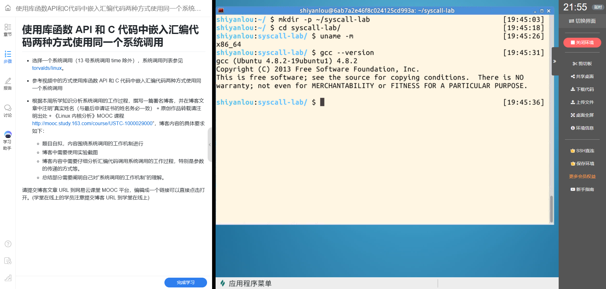
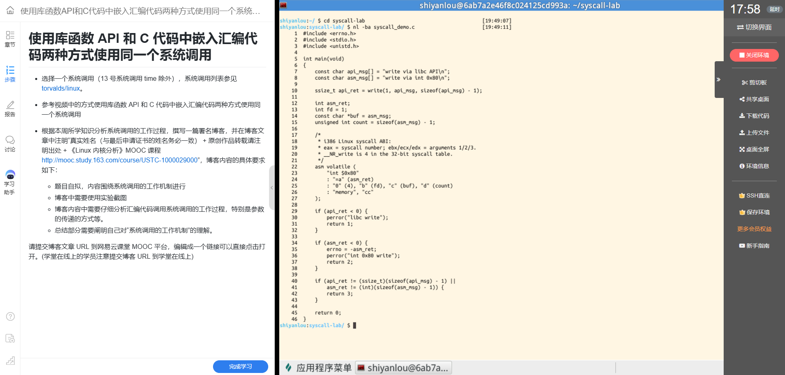
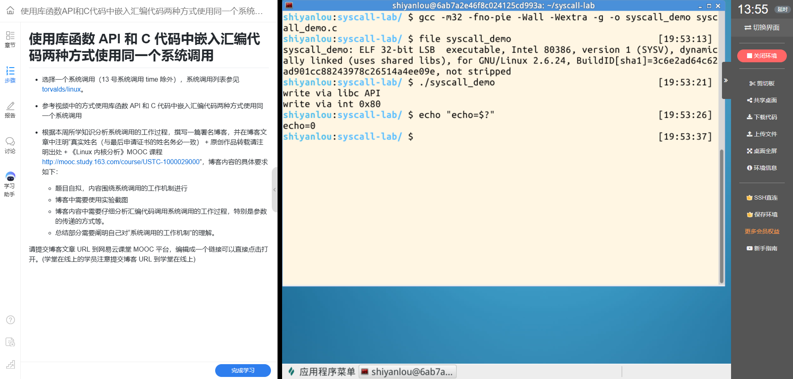
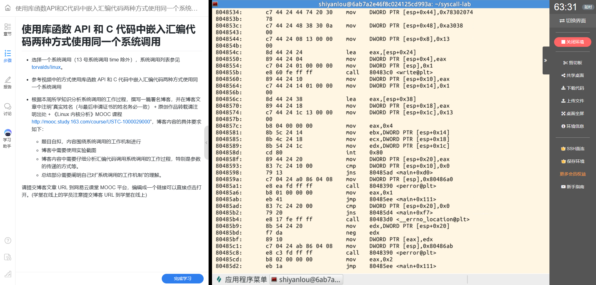
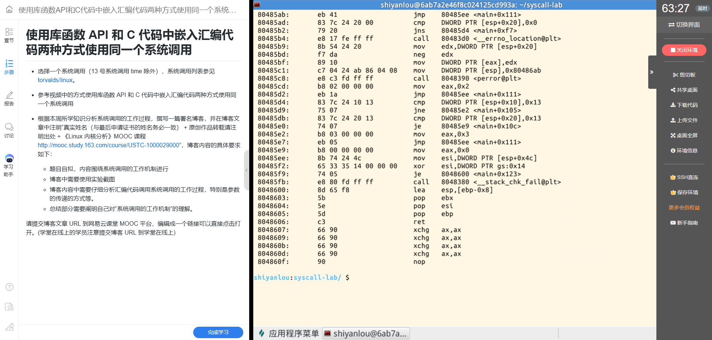

# 从 write() 到 int 0x80：一次系统调用的两种入口

**课程作业标题：**2026《Linux内核原理与分析》第五周作业  
**姓名：**叶丁再  
**学号：**20262809  
**实验主题：**使用库函数 API 和 C 语言内嵌汇编调用同一个系统调用

## 一、实验目标

本实验分别通过 C 库函数 write() 和内嵌汇编 int $0x80 输出文本，观察两种用户态调用方式如何到达同一个 Linux 系统调用。实验选用 32 位 x86 ABI 下的 write：系统调用号为 4，参数依次通过 ebx、ecx、edx 传递。这里的编号和寄存器约定属于 32 位 x86 系统调用 ABI，不能直接套用到 x86-64。

## 二、实验环境与源码

实验在实验楼 Linux 环境中完成。uname -m 显示主机为 x86_64，GCC 版本为 4.8.2；程序使用 -m32 编译，file 确认生成的是 32 位 i386 ELF 可执行文件。因此，本实验观察的是 32 位程序的系统调用约定。

以下截图保留实验楼中实际源码的终端证据。

## 三、实验源码与关键注释

下面列出本次实验使用的 syscall_demo.c。程序依次通过 libc 的 write() 和 32 位 x86 的 int 0x80 写出两行文本，并检查两种方式的返回结果。

~~~c
#include <errno.h>   // errno：保存 libc 转换后的错误码
#include <stdio.h>   // perror()
#include <unistd.h>  // write() 与 ssize_t

int main(void)
{
    const char api_msg[] = "write via libc API\n";
    const char asm_msg[] = "write via int 0x80\n";

    // 方式一：通过 libc 的 write() 函数写到标准输出。
    // 返回非负值表示实际写入字节数；失败时返回 -1 并设置 errno。
    ssize_t api_ret = write(1, api_msg, sizeof(api_msg) - 1);

    // 方式二：自行按 32 位 x86 Linux 系统调用 ABI 准备参数。
    int asm_ret;
    int fd = 1;                       // 第 1 个参数：标准输出
    const char *buf = asm_msg;        // 第 2 个参数：待写入缓冲区地址
    unsigned int count = sizeof(asm_msg) - 1; // 第 3 个参数：字节数，不含结尾的 NUL

    /*
     * i386 Linux 系统调用约定：
     * eax 放系统调用号；ebx、ecx、edx 放第 1、2、3 个参数。
     * __NR_write 在 32 位系统调用表中的编号为 4。
     */
    asm volatile (
        "int $0x80"
        : "=a"(asm_ret)                   // 从 eax 取回内核原始返回值
        : "0"(4), "b"(fd), "c"(buf), "d"(count)
        // "0"(4) 与输出约束 "=a" 共用 eax，调用前令 eax = 4。
        // "b"、"c"、"d" 分别要求 fd、buf、count 放入 ebx、ecx、edx。
        : "memory", "cc"                  // 告知编译器内存及条件码可能受影响
    );

    if (api_ret < 0) {
        perror("libc write");
        return 1;
    }

    // 直接系统调用的错误通常以负 errno 值放在 eax 中；
    // 这里将其转成 errno，再交给 perror() 输出错误信息。
    if (asm_ret < 0) {
        errno = -asm_ret;
        perror("int 0x80 write");
        return 2;
    }

    // 两种调用都应写出各自字符串中除结尾 NUL 外的全部字节。
    if (api_ret != (ssize_t)(sizeof(api_msg) - 1) ||
        asm_ret != (int)(sizeof(asm_msg) - 1)) {
        return 3;
    }

    return 0;
}
~~~

代码中的 1 是标准输出文件描述符。sizeof(...)-1 排除了 C 字符串末尾的 NUL 字节，因此 write 只输出可见文本和换行符。内嵌汇编的输出约束和输入约束共同描述了 eax 的读写关系；寄存器约束使编译器按 ABI 将参数放入指定寄存器。memory 与 cc 是告知编译器的 clobber 项，并不是额外传给内核的系统调用参数。
## 四、编译与运行结果

使用以下命令编译并运行：

~~~bash
gcc -m32 -fno-pie -Wall -Wextra -g -o syscall_demo syscall_demo.c
file syscall_demo
./syscall_demo
echo "echo=$?"
~~~

实验环境中的 GCC 4.8.2 不接受 -no-pie 这个选项；改用 -fno-pie 后编译成功。运行时先后出现 write via libc API 和 write via int 0x80，shell 显示 echo=0。这说明本次程序执行成功，并且两条路径都产生了预期输出。

## 五、从反汇编看参数传递

反汇编中先出现 call ... <write@plt>，这是 C 库函数调用经由过程链接表进入库函数的路径。该截图能证明程序调用了 write API；它没有展开 libc 内部实现，因此本文不据此断言 libc 最终使用了哪条具体机器指令进入内核。库函数负责封装系统调用，并提供更符合 C 接口习惯的错误处理。

紧接着的内嵌汇编路径在调用点附近可见：

关键指令的含义如下：

| 指令 | 含义 |
| --- | --- |
| mov eax, 0x4 | 将 32 位 x86 write 系统调用号 4 放入 eax |
| mov ebx, [..] | 将第 1 个参数文件描述符放入 ebx；本实验是标准输出 1 |
| mov ecx, [..] | 将第 2 个参数缓冲区地址放入 ecx |
| mov edx, [..] | 将第 3 个参数字节数放入 edx |
| int 0x80 | 触发软件中断，进入内核的 32 位系统调用入口 |

方括号中的栈偏移是编译器为当前函数分配局部变量后的具体布局。它们是编译结果，不是 ABI 固定的参数位置；真正需要关注的是执行 int 0x80 时各参数已经装入规定的寄存器。CPU 通过中断门从用户态转入内核态，内核依据 eax 中的系统调用号找到相应服务，再从寄存器取得参数。内核执行 write 后，将结果放入 eax，返回用户态继续执行。

返回值随后被保存到局部变量，并与零比较；非负值表示成功写入的字节数，负值表示内核返回的错误码。这里直接调用系统调用时，错误码以负数形式返回；代码将其转换为 errno 后交给 perror() 输出。后续截图展示了错误分支和函数返回路径：

## 六、两种方式的区别与联系

两种方式最终请求的是同一个内核服务：write。差别在于用户态接口：

- write() 是 libc 提供的函数接口。调用者按 C 函数形式传参，库函数负责系统调用封装，并把内核错误转换为 -1 和 errno。
- 内嵌汇编由程序显式遵循 32 位 x86 系统调用 ABI：把调用号和参数放入指定寄存器，再执行 int $0x80。因此程序还要自行检查原始返回值并处理错误。

“调用了库函数”不等于“已经直接看到了内核入口指令”。本次反汇编只显示 write@plt 调用，并直接显示内嵌汇编的 int 0x80；两种写法成功输出相同文本以及源码、ABI 约定共同支持上述分析。strace 在实验环境中未安装，因此本报告没有引用它的跟踪输出。

## 七、总结：我对系统调用工作机制的理解

系统调用是用户程序请求操作系统内核提供受保护服务的接口。普通函数调用在用户态按函数调用约定传递参数；系统调用则需要按处理器架构和 ABI 约定准备调用号与参数，通过特定入口指令切换到内核态。内核检查请求、执行相应服务，再把结果交还给用户程序。

这次实验让我把 C 接口、寄存器、int 0x80、内核服务和返回值联系起来。库函数 API 隐藏了不少底层细节，内嵌汇编则把系统调用约定直接呈现出来。理解系统调用，既要看调用前参数如何传递，也要看进入内核后的服务选择以及返回值如何被解释。

## 参考资料

- [Linux v3.18-rc6 32 位 x86 系统调用表](https://github.com/torvalds/linux/blob/v3.18-rc6/arch/x86/syscalls/syscall_32.tbl)
- [《Linux 内核分析》MOOC 课程](http://mooc.study.163.com/course/USTC-1000029000)

## 署名与转载说明

叶丁再（学号：20262809）

原创作品转载请注明出处：《Linux 内核分析》MOOC 课程  
[http://mooc.study.163.com/course/USTC-1000029000](http://mooc.study.163.com/course/USTC-1000029000)

**博客发布地址：**发布后补充。当前文件是待发布的 Markdown 文稿。

