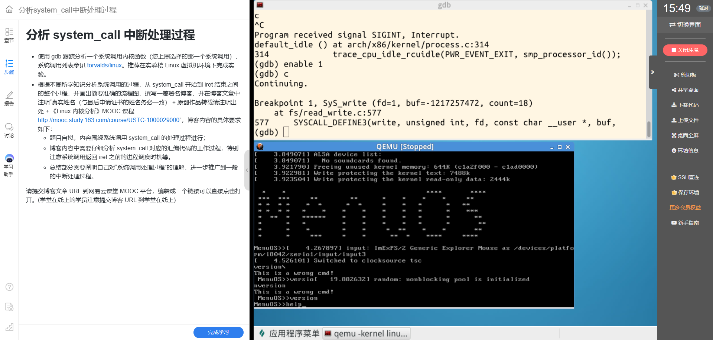
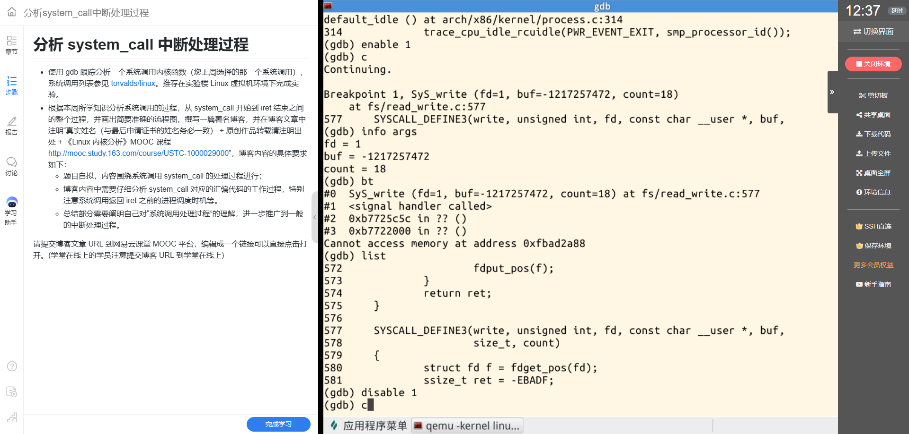
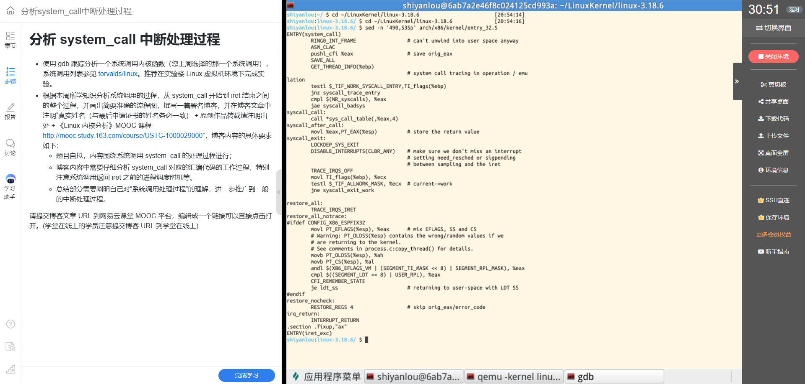
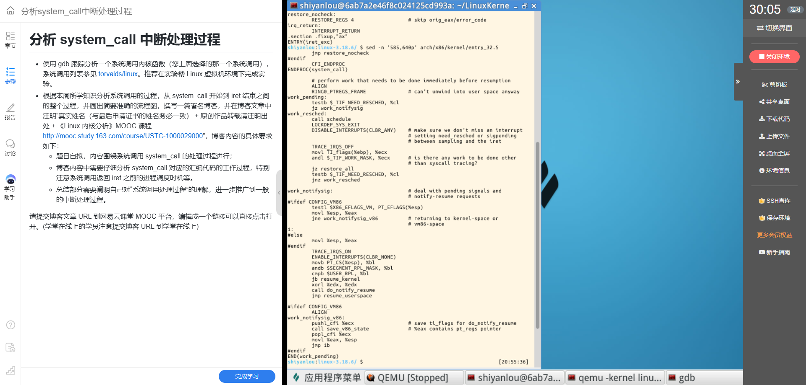

# 2026《Linux内核原理与分析》第六周作业：追踪 write 系统调用从 system_call 到 iret

**姓名：**叶丁再  
**学号：**20262809  
**实验主题：**分析 32 位 Linux 3.18.6 的 system_call 中断处理过程

## 一、实验目标与环境

本实验沿用上周选择的 write 系统调用。上周的实验在 32 位 x86 ABI 下通过 libc API 和内嵌汇编使用 write；本周进一步观察它在 Linux 内核中的处理函数，并结合 Linux 3.18.6 的 x86 入口汇编，分析从 system_call 到 iret 的主要路径，尤其关注返回用户态前可能发生的调度。

实验使用实验楼提供的 Linux 虚拟机、Linux 3.18.6 内核及 QEMU/GDB。GDB 在内核的 SyS_write 处理函数处命中，源码位置为 fs/read_write.c:577。对应的参数显示 fd=1、count=18；同时 QEMU 窗口显示 MenuOS 提示符和输入命令的上下文。

## 二、GDB 跟踪 write 内核处理函数

在 QEMU 中运行 MenuOS 时，GDB 断点停在 SyS_write。info args 显示：

- fd = 1：标准输出；
- buf = -1217257472：GDB 以有符号十进制形式显示的缓冲区参数；
- count = 18：本次写入的字节数。

这里的负数显示不能据此解释为无效指针或错误返回；它是调试器显示指针参数时的数值形式。实验截图没有读取缓冲区内容，因此本文不推断这 18 个字节的具体文本。

断点命中证明内核的 write 处理函数正在执行。截图中的调用栈包含 <signal handler called>，随后出现无法读取内存的提示，说明 GDB 没能从内核汇编入口继续正确展开到用户态调用者。这不代表断点失败；本实验将 GDB 命中和参数作为动态证据，将 system_call 到返回路径的执行关系与 entry_32.S 源码对照分析，不把源码阅读描述成 GDB 单步结果。

调试过程中，断点也曾在 initramfs 解包阶段命中内核内部的 xwrite 路径。那条路径不是用户态程序通过 int 0x80 进入系统调用的证据。筛选证据时，结合调用栈、fd 和 MenuOS 操作上下文，采用 fd=1 的命中作为本次报告的主要动态证据。

## 三、system_call 入口与系统调用分派

在 32 位 x86 Linux 中，用户程序执行 int 0x80 后，CPU 根据中断向量 0x80 转入内核设置的入口。Linux 3.18.6 在初始化时将该向量关联到 system_call。发生从用户态到内核态的特权级转换时，CPU 保存返回所需的用户态状态；入口汇编随后保存通用寄存器等现场。

截图中的关键入口逻辑可以按以下顺序理解：

1. system_call 入口保存原始 eax，并通过 SAVE_ALL 保存通用寄存器现场；GET_THREAD_INFO 获取当前线程信息。
2. 检查是否需要系统调用入口跟踪等额外处理，并验证 eax 中的系统调用号是否在有效范围内。
3. 执行 call *sys_call_table(,%eax,4)，按系统调用号索引系统调用表。32 位表项宽度为 4 字节；write 的系统调用号为 4，因此分派到 write 对应的内核处理函数。
4. 系统调用处理函数完成后，返回值在 eax 中；入口代码将它保存到 pt_regs 对应位置，供恢复用户现场时带回。

本实验在 SyS_write 处观察参数 fd=1 和 count=18。它与上周 write 实验中“文件描述符、缓冲区、字节数”这组三参数含义一致。入口截图展示的是 32 位系统调用表的通用分派代码；GDB 截图展示的是该分派最终到达 write 内核处理函数后的状态。

## 四、退出路径与返回前的调度时机

系统调用处理函数返回后，system_call 的退出路径会检查当前线程是否有待处理工作。若没有需要处理的标志，就进入 restore_all，恢复之前保存的寄存器现场，再执行中断返回。若有待处理工作，则转入 syscall_exit_work 等退出处理路径，进一步检查信号、跟踪请求和重新调度标志。

work_pending 会检查当前任务的 need_resched 标志。需要重新调度时，执行 call schedule；处理完后再回到用户态返回准备路径。若有待处理信号，则进入相应的信号处理路径。最后，内核恢复寄存器现场，并通过 INTERRUPT_RETURN 返回。此 32 位入口中的 INTERRUPT_RETURN 对应 iret 返回指令。

简化流程如下：

~~~text
用户态发起 32 位 write 系统调用（系统调用号 4，参数按 ABI 传递）
                         |
                         v
       CPU 特权级转换并保存返回所需的状态
                         |
                         v
 system_call：保存现场、检查入口工作与系统调用号
                         |
                         v
 sys_call_table 分派到 SyS_write / write 处理函数
                         |
                         v
       保存返回值到 pt_regs 对应位置
                         |
                         v
        检查 syscall_exit_work / 返回前工作
                 /                       \
         无待处理工作                有待处理工作
              |                 信号、跟踪等退出处理
              |                         |
              |                need_resched 是否置位？
              |                    /           \
              |                 是               否
              |                 |                |
              |          call schedule     继续退出检查
              |                 \               /
              +------------------+--------------+
                                 |
                                 v
               restore_all 恢复现场
                                 |
                                 v
                 INTERRUPT_RETURN（iret）
                                 |
                                 v
                   返回用户态继续执行
~~~

这里的 schedule 是**条件性的返回前调度时机**，不是每次 write 都会发生进程切换。只有退出路径检查到需要重新调度时才会调用。发生切换后，原任务的内核栈和现场仍保留；等它以后再次获得 CPU，才继续自己的退出路径并最终返回用户态。

CPU 在 int 0x80 导致特权级转换时保存的返回状态，与汇编入口通过 SAVE_ALL 保存的通用寄存器现场，是相互配合的两部分。返回时，内核先恢复软件保存的寄存器，再由 iret 恢复中断帧中的控制状态，从而回到用户态的后续指令。

## 五、对系统调用处理过程的理解

这次跟踪让我把用户态接口、系统调用入口、内核服务分派和中断返回连成一条路径：用户程序按 ABI 准备系统调用号和参数，CPU 经由中断门切换到内核态，system_call 保存现场并查表调用内核服务，服务结果进入返回现场，内核在 iret 之前检查信号和调度等工作，最后恢复现场回到用户态。

GDB 在 C 处理函数处提供了参数和源码位置的动态证据；汇编入口和返回代码则通过对应版本的 entry_32.S 分析。GDB 无法展开跨越汇编入口的完整调用栈时，应明确证据边界，再用源码解释控制流。普通中断处理也遵循相似的基本结构：保存现场、执行处理程序、检查必要的后续工作、恢复现场并返回；系统调用的特别之处在于它由用户程序主动触发，并按系统调用号选择内核服务。

## 参考资料

- Linux v3.18.6 源码：arch/x86/kernel/entry_32.S、arch/x86/syscalls/syscall_32.tbl、fs/read_write.c。系统调用号可查 [32 位 x86 系统调用表](https://github.com/torvalds/linux/blob/v3.18-rc6/arch/x86/syscalls/syscall_32.tbl)。
- 孟宁等：《庖丁解牛 Linux 内核分析》第 5 章 5.3 节“系统调用在内核代码中的处理过程”及第 8 章 8.1.2 节“进程调度时机”。
- [系统调用分析参考网页](https://www.cnblogs.com/rocedu/p/6016880.html)
- [《Linux 内核分析》MOOC 课程](http://mooc.study.163.com/course/USTC-1000029000)

## 署名与转载说明

叶丁再（学号：20262809，姓名与证书申请信息一致）。

原创作品转载请注明出处：《Linux 内核分析》MOOC 课程：  
[http://mooc.study.163.com/course/USTC-1000029000](http://mooc.study.163.com/course/USTC-1000029000)

**博客发布 URL：**发布后补充。本文目前为待发布 Markdown 文稿。

