# 2026《Linux内核原理与分析》第七周作业

**作者：叶丁再（学号：20262809）**  
**实验主题：分析 Linux 内核创建一个新进程的过程**  
**实验环境：Linux 3.18.6，x86 32 位内核，QEMU、GDB 与 MenuOS**

> 本文根据实际实验截图和 Linux 3.18.6 源码整理。GDB 在 `copy_thread` 入口读取到的部分字段值尚未逐步执行到最终赋值处，文中会明确区分动态观察与源码分析。

## 一、实验目标与方法

本次实验关注 `fork()` 如何进入内核，内核怎样创建子进程的 `task_struct`，以及子进程第一次获得 CPU 时从哪里开始执行。实验在 MenuOS 中增加了 `fork` 测试命令，并用 GDB 跟踪 Linux 3.18.6 内核中的 `sys_clone`、`do_fork`、`copy_process`、`dup_task_struct`、`copy_thread`、`wake_up_new_task` 和 `ret_from_fork`。

QEMU 使用 `-s -S` 暂停 CPU 并开放 GDB 连接；GDB 加载同一构建的 `vmlinux` 后设置断点。MenuOS 的 `help` 输出确认了 `fork` 命令已加入。启动和断点设置见图 1、图 2。

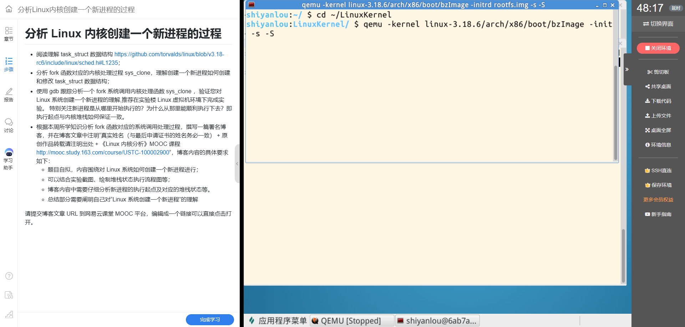

*图 1：使用 `-s -S` 启动 Linux 3.18.6 内核，为 GDB 跟踪作准备。*

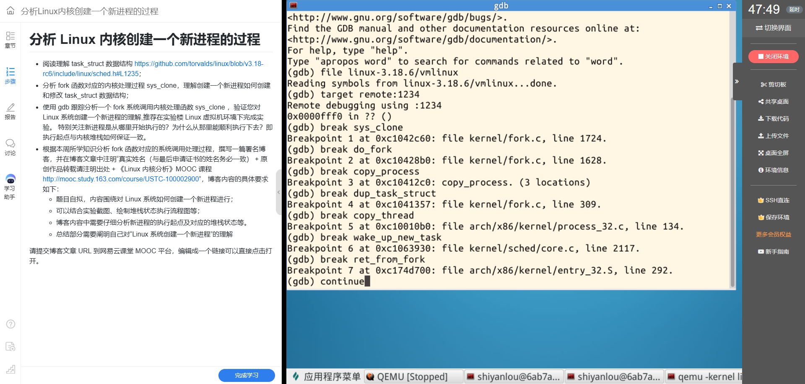

*图 2：GDB 加载 `vmlinux` 并设置进程创建路径上的断点。*

## 二、从 fork 到 sys_clone

在用户程序中调用 `fork()` 时，C 库通过 Linux 的进程创建系统调用进入内核。在本次 32 位实验中，GDB 命中了 `sys_clone`，调用栈显示其后进入 `do_fork`。这说明实际跟踪到的是 `fork` 对应的内核创建路径；本实验没有单步记录用户态库函数内部的入口指令，因此不把入口汇编写成动态观察结果。

`sys_clone` 将创建参数交给 `do_fork`。截图中 GDB 显示了 `clone_flags`、用户栈参数和 TID 指针等参数。`do_fork` 随后调用 `copy_process`；创建成功后取得子进程 PID，并调用 `wake_up_new_task(p)` 让新任务进入可运行状态。

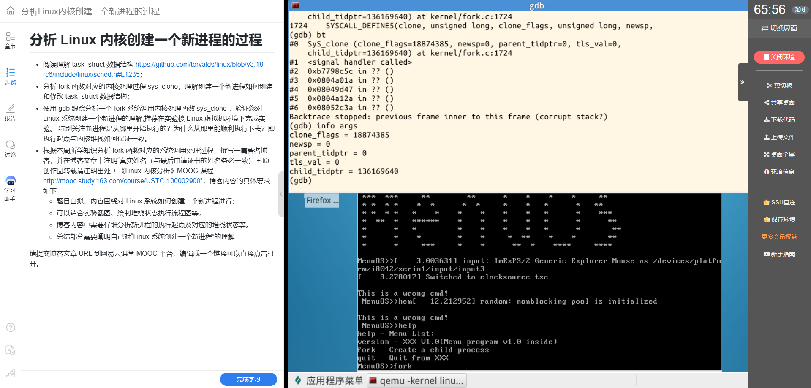

*图 3：GDB 在 `sys_clone` 路径中查看调用栈及参数。*

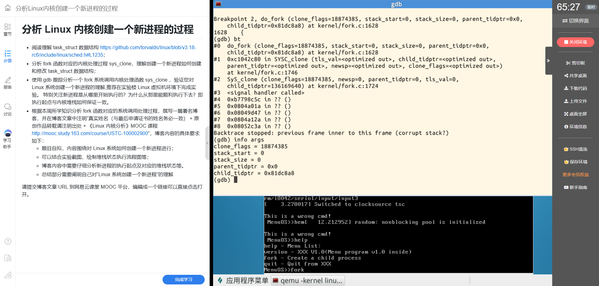

*图 4：`do_fork` 将创建请求交给 `copy_process`。*

## 三、task_struct 如何创建和初始化

`task_struct` 是内核描述任务的核心结构，其中包含任务状态、进程号、调度信息、地址空间、文件表、信号处理信息和体系结构相关线程上下文等。它不是一个单纯的“进程号记录”：调度器依靠任务状态和调度字段管理任务，内存管理和文件系统则通过相应指针访问进程资源。

Linux 3.18.6 的 `copy_process` 首先调用 `dup_task_struct(current)`。`dup_task_struct` 为新任务分配 `task_struct` 和独立的内核栈，再复制父任务的基础状态。随后 `copy_process` 通过 `copy_files`、`copy_fs`、`copy_sighand`、`copy_mm` 等函数，按 clone 标志选择复制或共享各类资源。因而“复制 task_struct”不等于父子进程共享同一个任务结构，也不表示所有内存页都立即逐字节复制；普通 `fork` 的地址空间由内存管理路径建立，页面通常采用写时复制机制。

GDB 在 `copy_process` 中命中 `dup_task_struct` 调用位置，随后进入体系结构相关的 `copy_thread`。这些断点把通用进程创建与 x86 线程上下文准备连接起来。

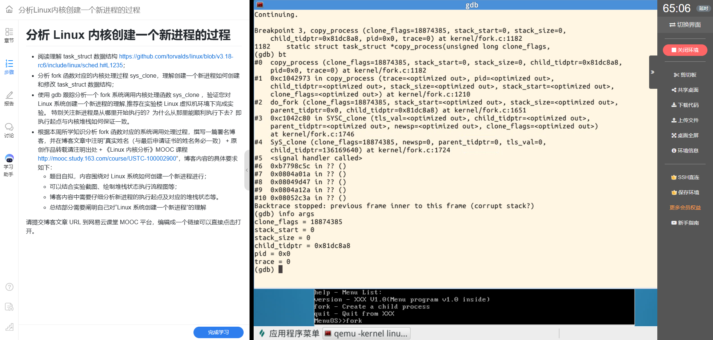

*图 5：`copy_process` 处理新任务，并显示本次调用的参数。*

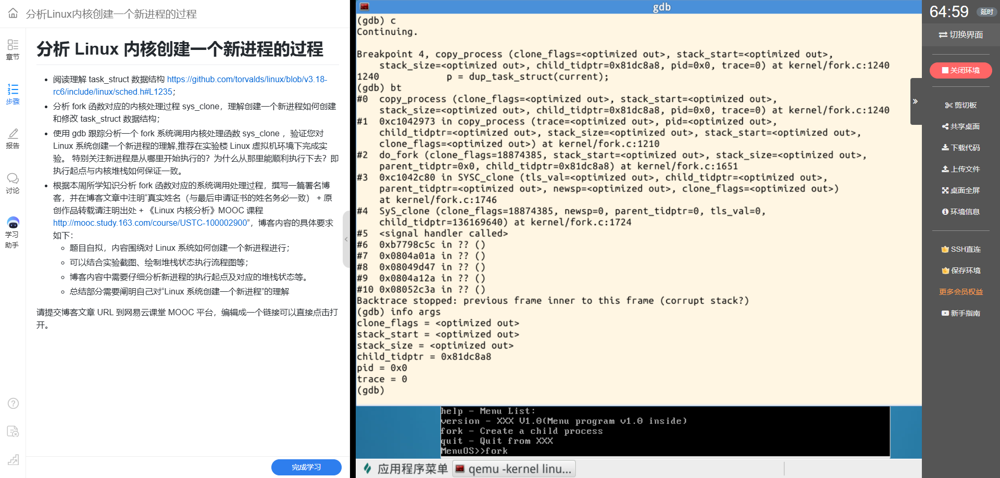

*图 6：在 `copy_process` 中观察到对 `dup_task_struct(current)` 的调用。*

## 四、执行起点与内核栈怎样配合

在 x86 32 位代码中，`copy_thread` 使用 `task_pt_regs(p)` 找到子进程内核栈上的寄存器现场 `childregs`。它把父进程当前的用户态寄存器现场复制到该位置，将 `childregs->ax` 设为 0；如果系统调用提供了新的用户栈指针，再更新 `childregs->sp`。同时，内核把子进程的 `thread.sp` 设置为这份寄存器现场，把 `thread.ip` 设置为 `ret_from_fork`。

这两类状态各自承担不同职责：`thread.sp` 指向子进程恢复内核执行时所需的栈内容，`thread.ip` 指定首次恢复时的内核继续执行位置；栈上的 `pt_regs` 则保存稍后返回用户态所需的寄存器状态。调度器第一次切换到这个新任务时，内核从预先准备的上下文进入 `ret_from_fork`，执行 `schedule_tail`，然后转入系统调用退出路径，恢复 `pt_regs` 并返回用户态。子进程因此从 `fork()` 之后继续执行，而不是从父进程正在运行的任意内核指令开始。

源码核心逻辑可概括为（Linux 3.18.6 `arch/x86/kernel/process_32.c`）：

```c
struct pt_regs *childregs = task_pt_regs(p);

p->thread.sp = (unsigned long) childregs;
p->thread.sp0 = (unsigned long) (childregs + 1);

*childregs = *current_pt_regs();
childregs->ax = 0;
if (sp)
    childregs->sp = sp;

p->thread.ip = (unsigned long) ret_from_fork;
```

图 7 是 `copy_thread` 断点和参数；图 11 展示源码中的寄存器现场处理，并记录了在函数入口读取任务字段的结果。此时 `p->pid` 仍显示为 1、`p->comm` 为 `init`，不能据此认定子进程最终 PID 也是 1。核对 `kernel/fork.c` 可知，`copy_process` 在 `copy_thread` 返回后才分配并写入新 PID；任务名则继承自父进程。图 11 中的 `sp/ip` 是函数入口处读取的值，未单步到初始化赋值之后，因此不作为子进程最终栈字段的动态测量值。子进程栈与入口的结论来自对应版本源码，并由后续 `wake_up_new_task` 和 `ret_from_fork` 断点佐证执行路径。

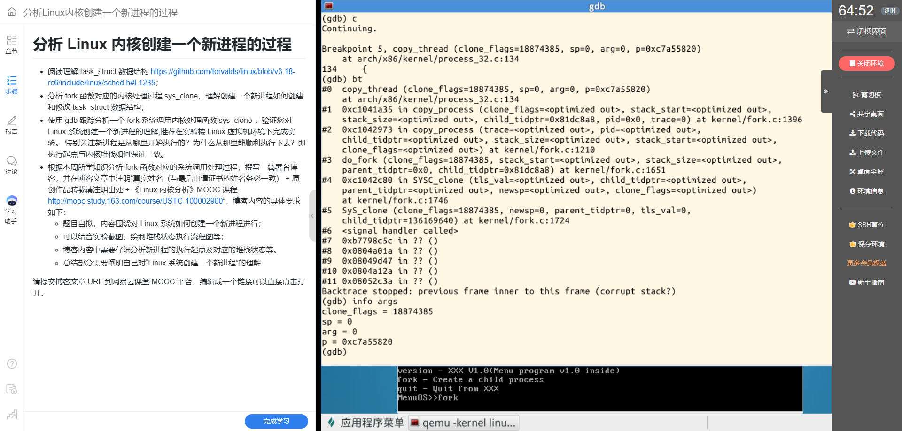

*图 7：GDB 命中 x86 32 位 `copy_thread`，可见子任务指针和函数参数。*

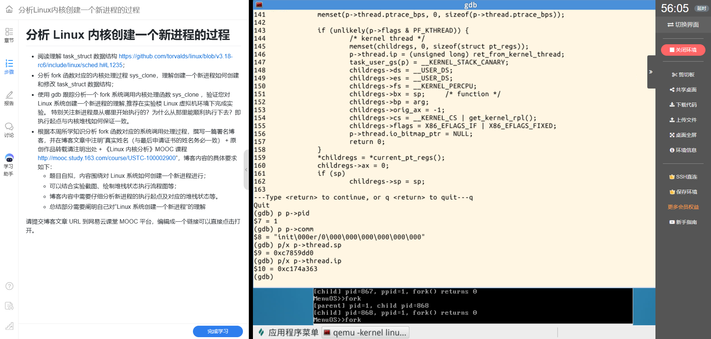

*图 8：寄存器现场复制、子进程 `ax=0` 的源码；下方字段查询发生在函数入口，PID 与栈字段不作最终状态证据。*

## 五、唤醒子进程并从 ret_from_fork 开始

`copy_process` 完成任务结构和上下文准备后，`do_fork` 调用 `wake_up_new_task(p)`。这一步使新任务具备被调度运行的条件。截图显示 GDB 命中 `wake_up_new_task`，随后命中汇编入口 `ret_from_fork`。这条动态路径与 `copy_thread` 中预先设置的执行入口相互印证。

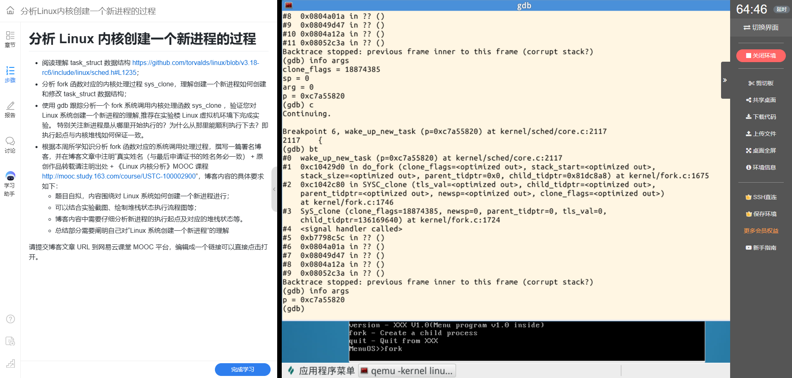

*图 9：新任务准备完成后进入唤醒路径。*

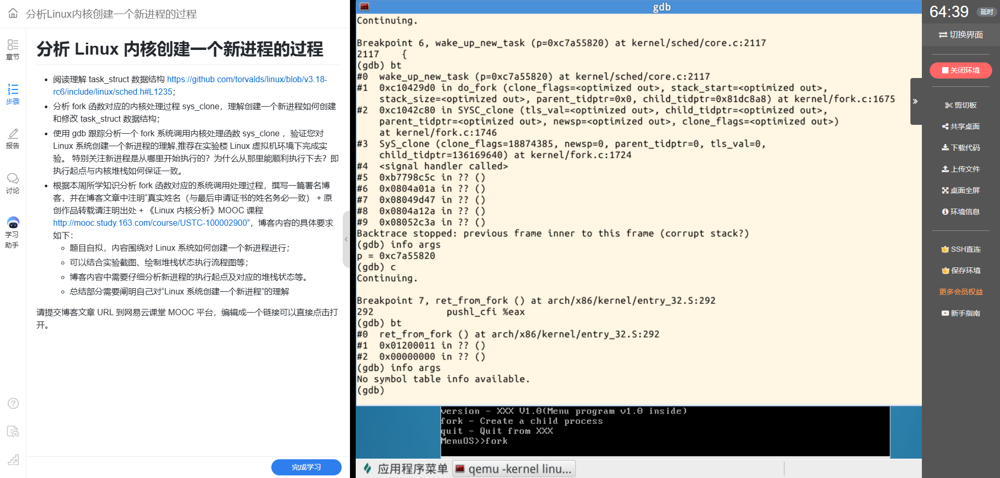

*图 10：子进程首次执行时命中 `ret_from_fork`。*

## 六、运行结果与父子返回值

MenuOS 测试命令在 `fork()` 返回后分别打印父子进程信息。截图记录父进程 PID 为 1、子进程 PID 为 867；父进程获得子进程 PID，子进程输出 `fork() returns 0`。这验证了父子进程从同一个 `fork()` 调用点继续执行，但通过各自寄存器现场观察到不同返回值。

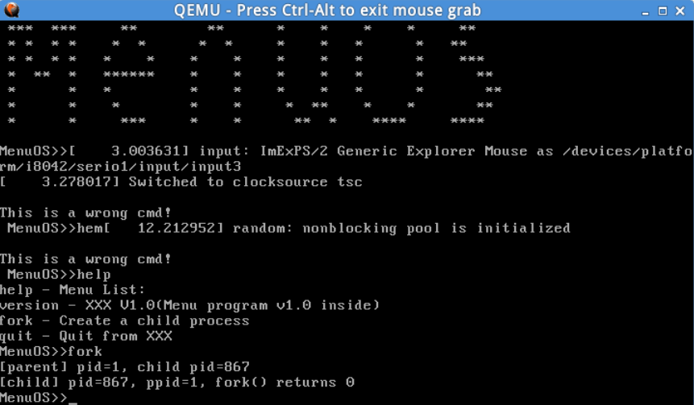

*图 11：实际运行输出区分父进程 PID、子进程 PID 以及子进程的返回值。*

## 七、实验流程

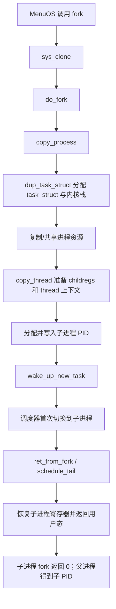

## 八、总结：我对 Linux 创建新进程的理解

我现在把 `fork` 理解为一次由内核协调完成的“任务对象创建、资源关系建立和执行现场准备”。`task_struct` 让内核能够识别并调度任务；`copy_process` 将通用资源复制或共享策略组织起来；`copy_thread` 则把体系结构相关的寄存器现场、内核栈和首次执行入口接好。`wake_up_new_task` 之后，子进程才有机会被调度运行。

子进程能从 `ret_from_fork` 顺利执行，是因为它的内核栈与恢复入口在创建阶段已经配套准备好；栈上的 `pt_regs` 又让它最终返回到父进程调用 `fork()` 后的位置。父进程看到子 PID、子进程看到 0，并非 `fork` 函数在用户态凭空分出两条结果，而是内核为两个执行上下文准备并恢复了不同的返回状态。

本次 GDB 中 `copy_thread` 的部分字段只读到了函数入口状态，没有单步验证赋值后的数值；因此我依据 Linux 3.18.6 源码说明最终的 `thread.sp`、`thread.ip` 设置，并用实际命中 `ret_from_fork` 和 MenuOS 父子输出验证整体执行路径。后续若要补足字段级动态证据，应在 `copy_thread` 执行过相关赋值语句后再读取字段。

## 参考资料

1. Linux 3.18.6 `include/linux/sched.h`：[`task_struct` 定义](https://github.com/gregkh/linux/blob/v3.18.6/include/linux/sched.h)
2. Linux 3.18.6 `kernel/fork.c`：[`copy_process`、`dup_task_struct`、`do_fork` 与 `sys_clone`](https://github.com/gregkh/linux/blob/v3.18.6/kernel/fork.c)
3. Linux 3.18.6 `arch/x86/kernel/process_32.c`：[`copy_thread`](https://github.com/gregkh/linux/blob/v3.18.6/arch/x86/kernel/process_32.c)
4. Linux 3.18.6 `arch/x86/kernel/entry_32.S`：[`ret_from_fork`](https://github.com/gregkh/linux/blob/v3.18.6/arch/x86/kernel/entry_32.S)

---

**叶丁再（学号：20262809）**  
**原创作品转载请注明出处**  
**《Linux内核分析》MOOC课程：[http://mooc.study.163.com/course/USTC-1000029000](http://mooc.study.163.com/course/USTC-1000029000)**

> 发布后请将博客 URL 提交到网易云课堂 MOOC 平台；本文目前为 Markdown 草稿，尚未发布，故不填写博客 URL。
