# 从 `execve` 到新入口：Linux 如何装载并启动 ELF 程序

**课程：**《Linux内核原理与分析》  
**实验：**实验七（第八周）  
**姓名：**叶丁再  
**学号：**20262809  
**日期：**2026 年 9 月 27 日

## 一、问题：执行新程序时，旧程序去了哪里？

在 shell 或程序中执行一个命令，看起来像“启动了另一个程序”。Linux 的关键动作是 `execve`：内核检查并装载新的可执行文件，用新的地址空间、代码、数据和初始用户栈替换调用进程原来的用户态映像。成功时，`execve` 不会返回到旧程序的下一条指令；失败时才返回错误。

本实验围绕三个问题展开：ELF 文件怎样描述装载需求？`execve` 内核路径如何建立新程序的入口和栈？静态链接与动态链接程序开始运行时有什么不同？

## 二、实验环境与证据

实验在实验楼环境中完成，内核调试对象为 Linux 3.18.6 的 `vmlinux`，QEMU 通过 `bzImage` 和 `rootfs.img` 启动 MenuOS。用户态测试覆盖了静态、动态 ELF，装载时动态链接、运行时 `dlopen`，以及通过 `execv` 和 MenuOS 菜单执行程序。

下文将截图直接显示的内容称为“实验观察”；由 Linux 3.18.6 源码与 ELF 规则得出的内容称为“机制分析”。GDB 在 `sys_execve` 的栈回溯曾出现无法继续展开的提示，因此不把用户态调用栈说成已经完整动态跟踪。

## 三、先看 ELF：入口地址和解释器信息

ELF 文件包含 ELF header、程序头表、节区等信息。装载器主要依据程序头表中的 `PT_LOAD` 将文件内容映射到进程地址空间。ELF header 中的 `e_entry` 给出该 ELF 映像的入口地址；若存在 `PT_INTERP`，它还指出运行该映像所需的 ELF 解释器。

实验中的 `hello-static` 是 32 位 i386 静态 ELF，入口为 `0x8048d0a`，没有 `PT_INTERP`。`hello-dynamic` 同样是 32 位 i386 ELF，应用入口为 `0x8048350`，并带有 `/lib/ld-linux.so.2` 解释器段，动态节还声明依赖 `libc.so.6`。

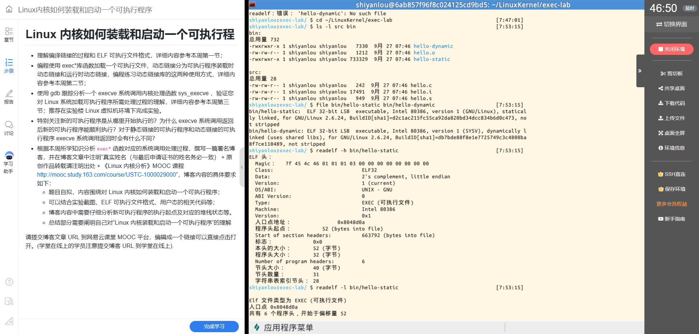

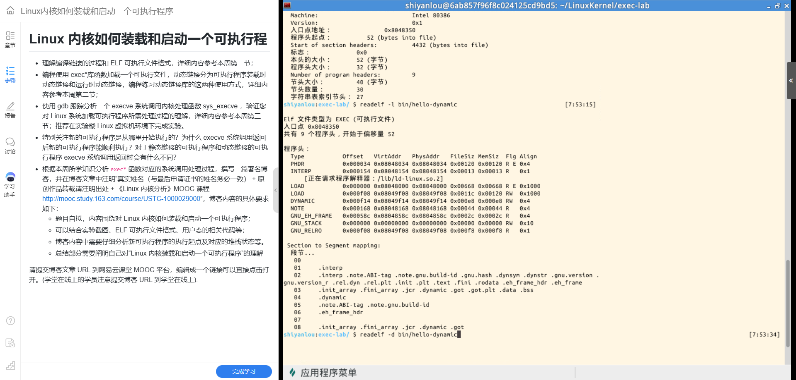

### 两种动态库使用方式

实验还用 `libgreet.so` 对比了两类动态链接。`greet-linked` 的动态节中有 `NEEDED: libgreet.so`，并通过 `$ORIGIN/../lib` 查找库；程序启动装载时，动态链接器会解析这个依赖。`greet-dlopen` 的动态节没有 `libgreet.so` 这一项，而是由程序运行到相应代码后调用 `dlopen` 打开库，再通过 `dlsym` 找到 `greet` 函数。两种程序都实际输出了问候信息。

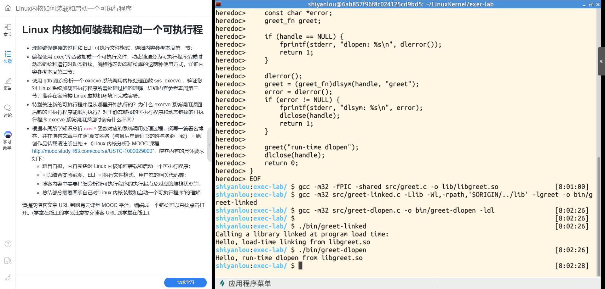

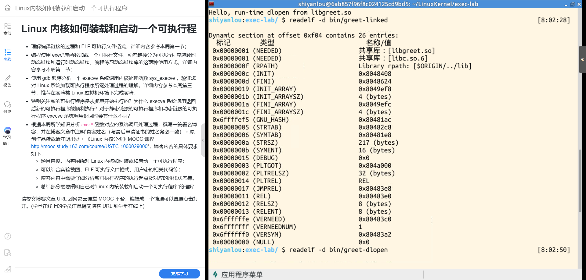

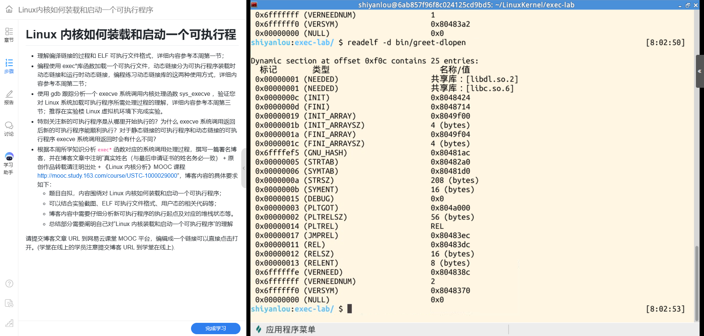

## 四、用户态 `execv` 测试

`execv(path, argv)` 是 libc 提供的执行接口之一，底层请求内核执行指定路径。下面是实验使用的执行驱动程序的核心逻辑（整理了截图中因终端编码显示异常的提示字符串；路径选择、参数构造和 `execv` 调用与实验一致）：

```c
#include <stdio.h>
#include <string.h>
#include <unistd.h>

int main(int argc, char *argv[])
{
    const char *path;
    char *child_argv[3];

    if (argc != 2 ||
        (strcmp(argv[1], "static") != 0 &&
         strcmp(argv[1], "dynamic") != 0)) {
        fprintf(stderr, "usage: %s static|dynamic\n", argv[0]);
        return 1;
    }

    path = (strcmp(argv[1], "static") == 0)
         ? "./bin/hello-static"
         : "./bin/hello-dynamic";

    child_argv[0] = (char *)path;
    child_argv[1] = "from-execv";
    child_argv[2] = NULL;

    printf("execv -> %s\n", path);
    fflush(stdout);
    execv(path, child_argv);

    /* 只有 execv 失败，控制流才会到达这里。 */
    perror("execv");
    return 1;
}
```

运行截图中，静态和动态目标程序都输出 `Hello from the new executable!`，并显示 `argc = 2`、`argv[0]` 为程序路径、`argv[1] = from-execv`。新程序读取到的参数说明内核在建立新用户栈时也带入了调用者提供的参数向量。

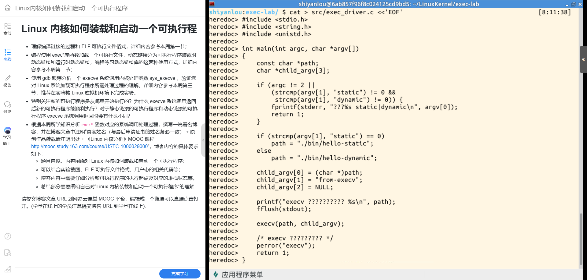

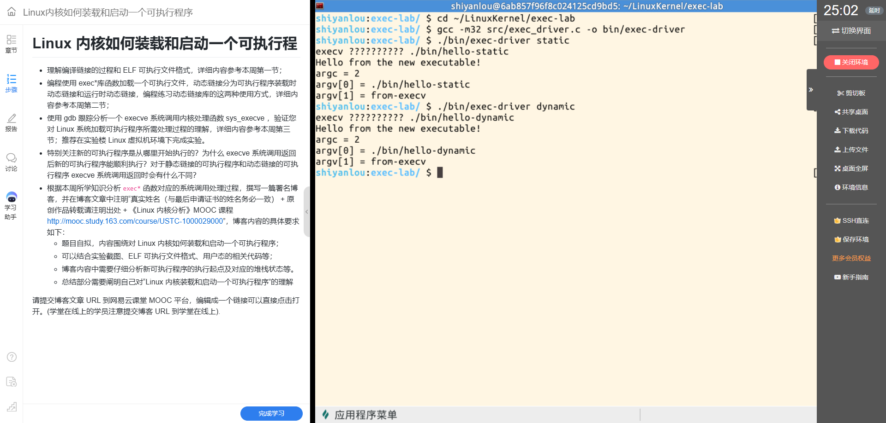

MenuOS 测试采用 `fork` 后由子进程执行 `execv`，父进程等待子进程结束。QEMU 中分别执行静态和动态目标，二者都输出 `argv[1] = from-MenuOS`，子进程退出码为 0，MenuOS 提示符恢复。这同时验证了 initramfs 中程序及动态解释器、共享库等依赖可被找到。

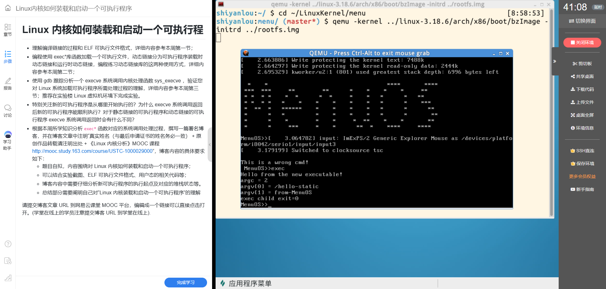

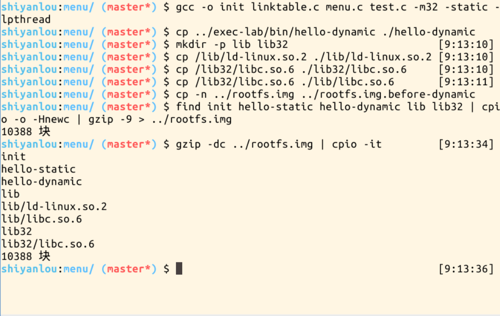

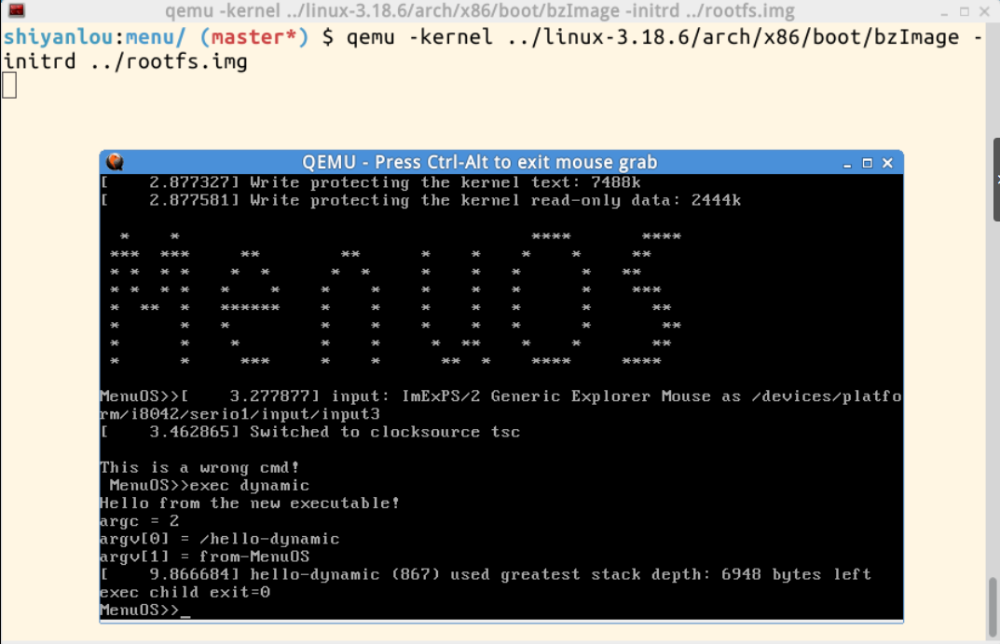

## 五、从系统调用到 `start_thread`

GDB 使用与 QEMU 内核对应的 `vmlinux` 设置 `sys_execve`、`load_elf_binary` 和 `start_thread` 断点。截图显示的主要调用路径为：

```text
用户态 execv()
  └─ execve 系统调用
      └─ SYSCALL_DEFINE3(execve) / Sys_execve
          └─ do_execve()
              └─ exec_binprm() / search_binary_handler()
                  └─ load_elf_binary()
                      └─ start_thread(regs, new_ip, new_sp)
                          └─ 系统调用退出并返回用户态新映像
```

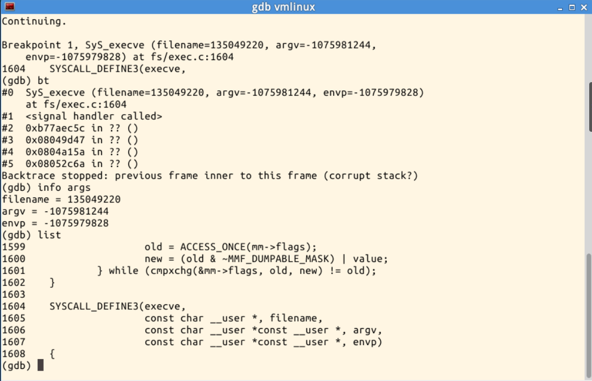

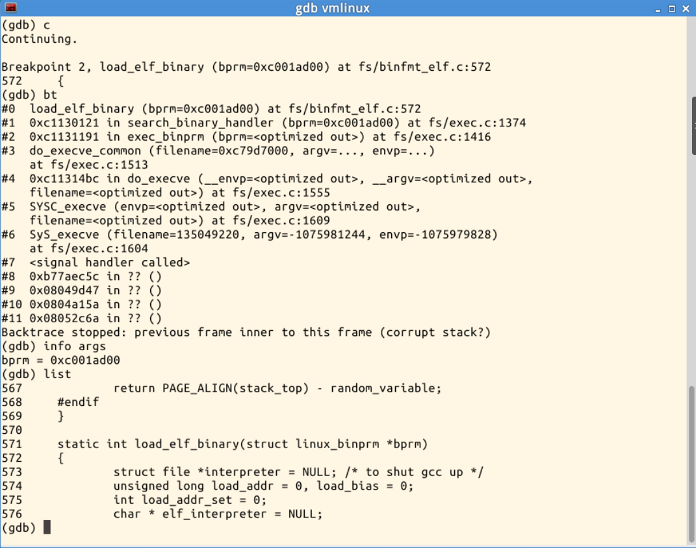

这条路径体现了内核的分工：`execve` 系统调用把文件名、参数和环境向量交给执行子系统；二进制格式处理器识别 ELF；`load_elf_binary` 检查 ELF 头和程序头、映射程序段、处理解释器并准备新地址空间；最后 `start_thread` 更新保存的用户态寄存器现场，让系统调用返回路径回到新程序的入口。

实验截图中，静态目标在 `start_thread` 处得到 `new_ip = 0x8048d0a`、`new_sp = 0xbfbf3080`。`new_ip` 与静态 ELF 的 `e_entry` 一致，说明无解释器时处理器从应用映像入口开始执行。`new_sp` 是传给 `start_thread` 的用户栈指针值；截图没有转储该地址附近的内存，因此不能把栈中每个字段说成现场直接读出。

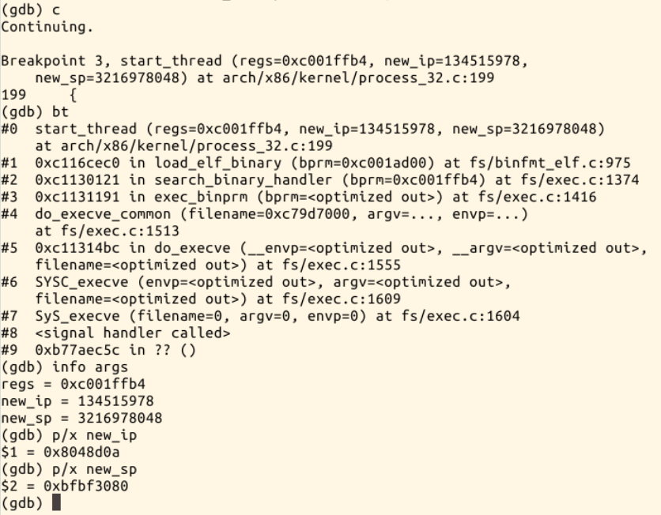

## 六、动态 ELF 为什么先进入解释器

动态 ELF 的 `PT_INTERP` 指定动态链接器。实验确认解释器路径为 `/lib/ld-linux.so.2`，程序依赖 `libc.so.6`。Linux 3.18.6 的 ELF 装载路径会同时安排主程序和解释器映像；当存在解释器时，`start_thread` 的 `new_ip` 指向解释器入口，而不是直接等于应用程序的 `e_entry`。

本次 GDB 截图中，动态 ELF 的 `new_ip = 0xb77d90d0`，`new_sp = 0xbfed8be0`。应用本身的 `e_entry` 是 `0x8048350`，两者不同；结合 `PT_INTERP`，可以解释为处理器先进入动态链接器。动态链接器随后完成共享对象映射和必要的重定位，再把控制权交给应用程序入口。因而，`execve` 返回用户态时，静态程序通常已在自身入口开始运行；动态程序则先从 ELF 解释器入口运行，之后才进入应用入口。

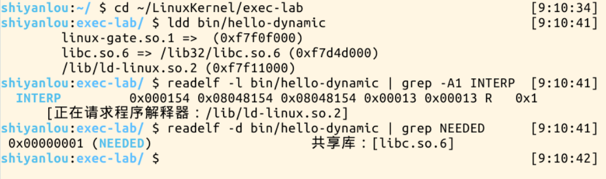

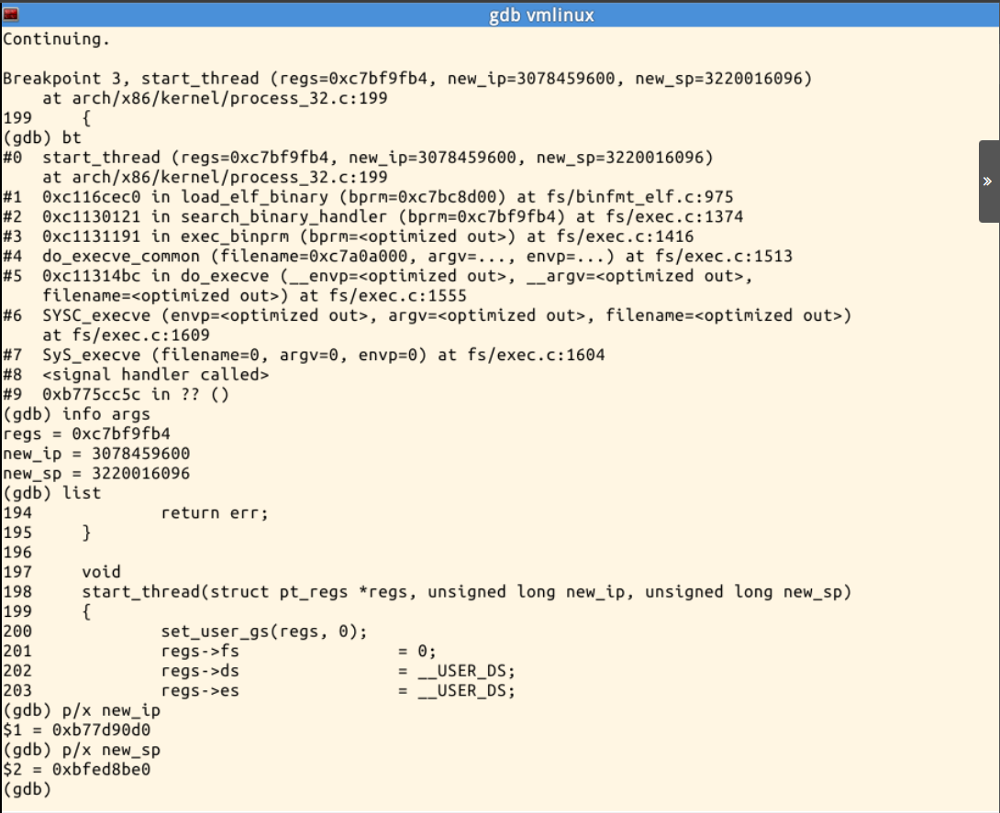

动态程序的入口与栈地址和静态程序不同，也可能受地址空间布局随机化及映射布局影响。这里记录的是本次截图中的具体数值，不应当视为每次运行都固定的地址。

## 七、初始用户栈承载什么

无论静态还是动态程序，内核都要为新映像准备参数、环境变量和辅助向量等初始信息。对 32 位 x86 用户态，初始栈顶可概念化为：

```text
低地址 / 初始 ESP 指向
┌─────────────────────────────┐
│ argc                        │
├─────────────────────────────┤
│ argv[0] 指针                │
│ argv[1] 指针                │
│ ...                         │
│ NULL                        │
├─────────────────────────────┤
│ envp[0]、envp[1] ...        │
│ NULL                        │
├─────────────────────────────┤
│ auxv（类型/值对，以 AT_NULL 结束）│
├─────────────────────────────┤
│ 参数字符串、环境字符串等     │
└─────────────────────────────┘
高地址
```

这表示程序无需沿用旧程序的调用栈帧；它从内核建立的全新启动栈和入口寄存器现场开始。程序运行时的 C 运行库启动代码再根据 `argc`、`argv`、`envp` 和辅助向量完成初始化并调用 `main`。此图是根据 ELF 用户态启动约定和 Linux 装载机制整理的概念图，本次实验只观察了 `new_sp` 数值和目标程序打印出的参数，没有用 GDB 逐字节检查栈内存。

## 八、装载与启动流程

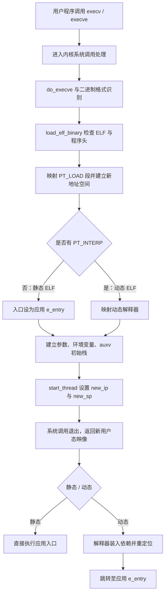

## 九、总结：计算机怎样开始执行一个新程序

这次实验让我看到，“执行一个程序”不是简单地把文件读进内存再跳过去。用户态先通过系统调用提出请求；内核识别 ELF 格式，验证文件并按程序头建立映射，准备新的地址空间、入口寄存器和初始栈；随后处理器从 `start_thread` 设置的用户态入口继续执行。系统调用边界连接了受保护的内核机制和用户程序的运行现场。

静态程序的入口直接来自 ELF 的 `e_entry`；动态程序还要经过 `PT_INTERP` 指定的动态链接器，由解释器准备共享库和重定位后再进入应用入口。`argv`、环境变量和辅助向量则通过初始用户栈传给启动代码。由此我理解，计算机“开始工作”依赖的不只是指令地址，还包括地址空间、寄存器现场、栈中约定的数据以及内核与用户态之间清晰的交接。

## 参考与版权说明

- Linux 3.18.6 内核源码：`fs/exec.c`、`fs/binfmt_elf.c`、`arch/x86/kernel/process_32.c`。
- System V ABI：ELF 文件格式与进程初始化约定。

叶丁再（学号：20262809）。原创作品转载请注明出处：《Linux 内核分析》MOOC 课程：[http://mooc.study.163.com/course/USTC-100002900](http://mooc.study.163.com/course/USTC-100002900)。

> 本文为博客草稿；发布后请将实际博客 URL 提交到课程平台，不要把本地文件路径当作发布链接。
