# 从 schedule() 到 switch_to：Linux 3.18.6 的调度时机与任务切换

**课程：**《Linux 内核原理与分析》  
**实验：**实验八（第九周）  
**姓名：**叶丁再（真实姓名须与最后申请证书的姓名一致）  
**学号：**20262809  
**日期：**2026 年 9 月 27 日  

**原创作品转载请注明出处：**叶丁再  
**课程：**《Linux 内核分析》MOOC 课程 <http://mooc.study.163.com/course/USTC-1000029000>

## 一、实验目标与环境

本次实验关注三个问题：Linux 在什么情况下进入调度器；调度器选择另一个任务后怎样切换 CPU 的内核执行现场；这种任务切换与系统调用/中断入口保存的现场是什么关系。

云端环境使用 Linux 3.18.6、x86 32 位内核、QEMU 和 GDB。环境检查截图显示 `vmlinux` 是 32 位 Intel 80386 ELF，`bzImage` 与 `rootfs.img` 均存在。每个课程实验会重置云端环境，因此本周启动的 MenuOS 没有实验六添加的 `fork` 命令；`help` 只列出版本和退出命令。本次没有把旧实验的 MenuOS 改动当作当前证据，也没有为调度跟踪重编译它。

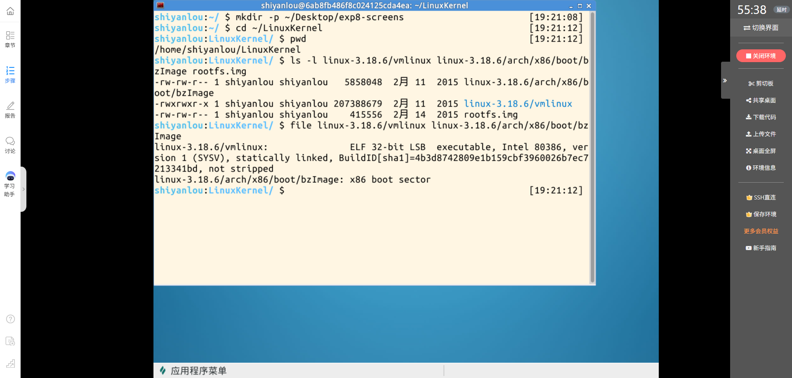

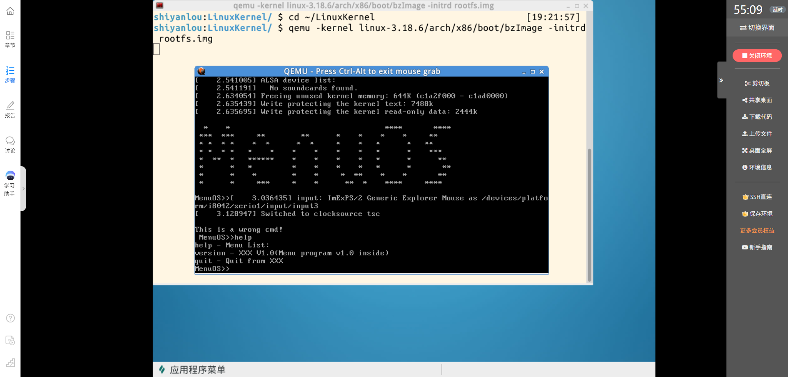

由于当前 MenuOS 没有自定义进程创建命令，我从内核启动时的调度路径开始跟踪。这样可以直接观察现有内核中的任务切换，不依赖实验之间不会保留的用户态命令。

## 二、搜索 schedule()：调用命中只是候选清单

我在 Linux 3.18.6 源码树中搜索 `schedule()` 以及 `schedule_timeout()`、`io_schedule()`、`cond_resched()`、`preempt_schedule()` 等调度封装。终端显示第一组表达式得到 605 行，第二组得到 922 行。

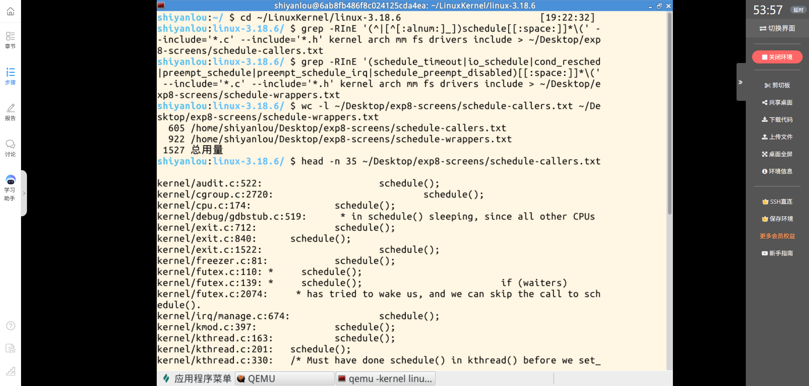

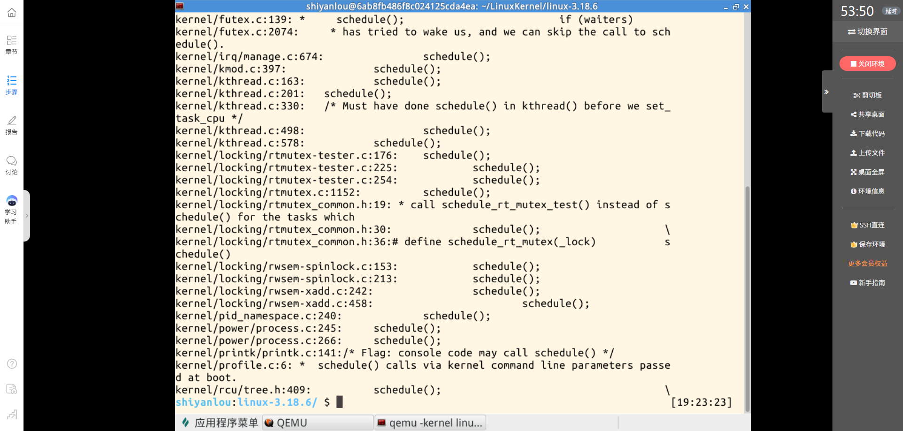

这些数字是 grep 对源码文本的匹配行数，不等于 605 次或 922 次实际调度。搜索还会匹配注释、定义、声明、宏以及条件编译代码；必须结合上下文区分“某处写着 schedule”与“本次运行真正调用了调度器”。这次保存的结果适合作为待检查清单，不能直接当成完整的已分类调用统计。

从源码和本次观察可以把调度相关时机概括为几类：

1. **任务主动等待或睡眠。**任务在等待资源、定时器或其他任务时改变自身状态，并沿等待路径调用 `schedule()` 或相关封装。调度器随后选择可运行任务。
2. **内核中的主动让出点。**`cond_resched()` 等封装允许内核在满足条件时检查是否需要重新调度；封装被调用不代表每次都会切换。
3. **重调度请求。**定时器 tick、任务唤醒或优先级变化可能设置 `need_resched`/任务标志。设置标志只是请求，内核要等到允许调度的安全位置再处理。
4. **系统调用或异常返回前。**x86 32 位的 `entry_32.S` 中，`work_pending` 检查 `TIF_NEED_RESCHED`；标志未设置时走其他返回工作，设置时才调用 `schedule`，之后还会重新检查标志。

本次源码截图里，`schedule()` 本身先调用 `sched_submit_work(tsk)`，再进入 `__schedule()`。这也说明调度入口和实际任务切换不是同一概念：调度器仍可能选择当前任务；只有 `prev` 和 `next` 不同，才会走到实际的上下文切换。

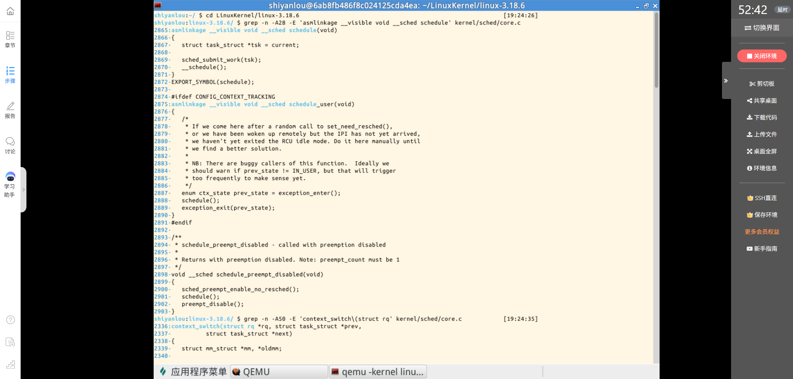

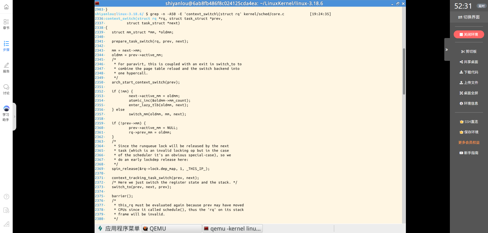

在 `context_switch()` 中，Linux 先准备任务切换状态，再根据 `mm` 关系执行 `switch_mm()` 或处理活动地址空间，之后调用架构相关的 `switch_to(prev, next, prev)`。切换完成后还会执行 `finish_task_switch()`。地址空间处理和寄存器/内核栈切换各有职责，不能把整个进程切换简化为一条汇编指令。

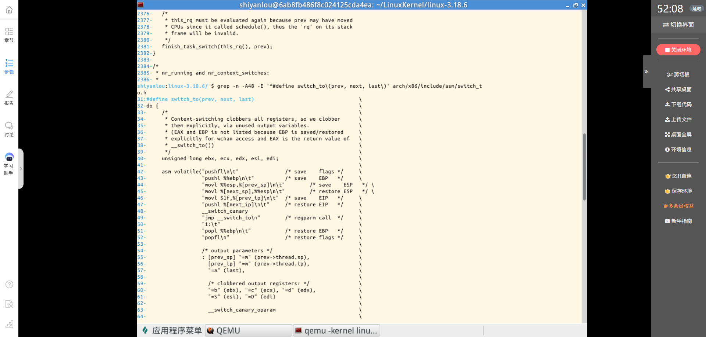

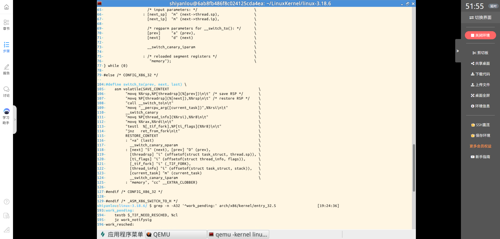

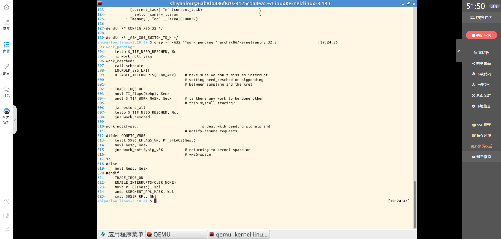

## 三、GDB：从启动期调度入口到真实任务切换

GDB 加载与 QEMU 启动镜像配套的 `vmlinux`，连接 QEMU 的 GDB stub，并设置 `schedule` 与 `__switch_to` 断点。GDB 显示 `break schedule` 解析为多个位置；继续运行后，第一次停在 `schedule_preempt_disabled()` 中调用 `schedule()` 的位置（`kernel/sched/core.c:2901`）。调用栈依次回到 `rest_init()`、`start_kernel()` 和 `i386_start_kernel()`。因此这次命中来自 Linux 启动期路径，不是 MenuOS 用户命令，也不是一次已观察到的系统调用退出。

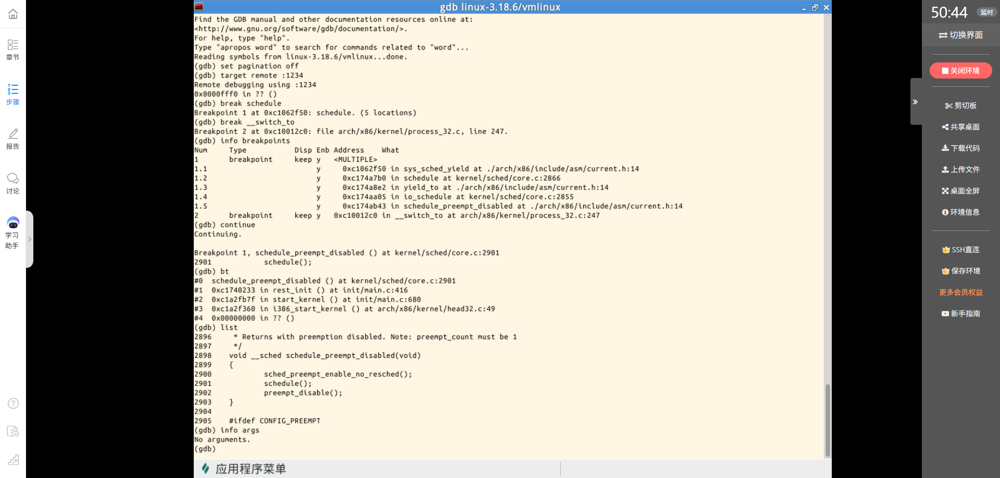

我禁用 `schedule` 断点后继续运行，GDB 在 `__switch_to()` 处停下。参数和结构体字段显示：

- `prev_p` 指向 `init_task`，PID 为 0；
- `next_p` 的 PID 为 2；
- `prev_p->thread.sp` 为 `0xc19b5f34`；
- `next_p->thread.sp` 为 `0xc7869fb4`。

PID 0 到 PID 2 的不同，连同 `__switch_to(prev_p, next_p)` 的断点，证明启动过程中确实从一个任务切换到另一个任务。它不是“只命中 `schedule()`”，也不是 MenuOS 用户进程之间的切换。GDB 对 `comm` 字段的显示不可靠，因此这里依据可读的 PID、指针和栈字段陈述结果，不用任务名补足结论。

GDB 在该断点处的 `bt` 提示回溯在此停止，并出现栈完整性警告。任务切换正在改变当前内核栈和执行位置；不能把跨过 `switch_to` 前后的栈帧当作一条普通、连续的 C 调用链。这个警告说明调试器无法按普通栈帧规则继续展开，不会推翻参数中观察到的两个任务 PID。

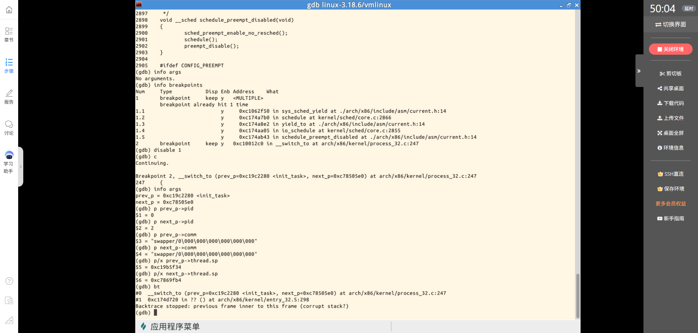

## 四、switch_to：怎样保存旧栈并接上新栈

Linux 3.18.6 x86 32 位的 `switch_to` 宏把旧任务的内核执行现场留在它自己的栈和 `thread` 字段里，再从新任务的栈与继续位置恢复执行。源码和本次反汇编共同显示了这个关键次序：

1. `pushfl` 和 `pushl %ebp`：把标志寄存器和帧指针保存在当前任务的内核栈上。
2. `movl %esp, prev->thread.sp`：记录旧任务当前的栈指针。
3. `movl next->thread.sp, %esp`：把 CPU 的栈指针换到新任务的内核栈。
4. `movl $1f, prev->thread.ip`：把旧任务恢复后要继续执行的本地标签地址保存到 `prev->thread.ip`。
5. `pushl next->thread.ip`：把新任务的继续地址压入新栈。
6. `jmp __switch_to`：转入架构相关的切换代码；返回后由标签 `1` 处的 `popl %ebp`、`popfl` 恢复新任务自己的帧指针和标志寄存器。

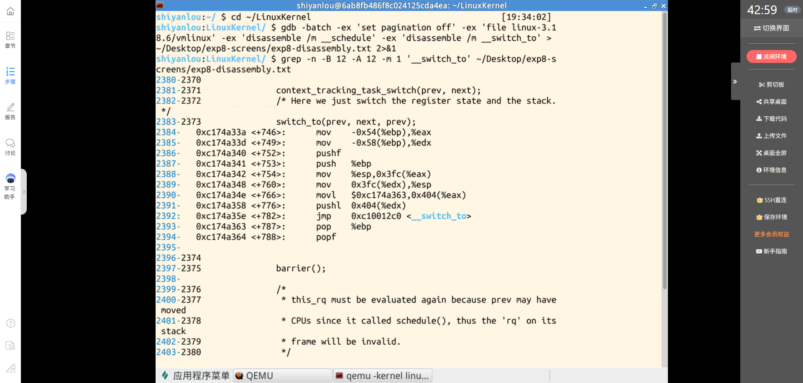

反汇编中，这些指令出现在 `context_switch()` 内联展开的位置：先将参数指针装入寄存器，再保存和装载 ESP，保存旧的继续地址、压入新的继续地址，最后跳转到 `__switch_to`。截图里的结构偏移和指令地址属于这次 Linux 3.18.6 构建，不应当当作所有内核版本或架构的固定数值。

任务切换保存的是内核执行上下文。一个已经运行过的任务稍后再次被选中时，会从自己先前保存的栈和继续位置接着执行；它并不会重新从内核入口开始。新创建任务的首次运行入口则需要在创建时专门准备，例如实验六分析过的 `ret_from_fork`。本次 PID 0→2 的跟踪没有读取 `next` 的 `thread.ip`，所以该字段的实际值不写成本次动态观察结果。

## 五、switch_to 与中断现场不是同一件事

系统调用或中断入口会建立返回所需的寄存器现场和内核栈帧；在 x86 32 位路径中，相关现场通过入口汇编、`pt_regs` 等机制保存和恢复。用户任务进入内核处理系统调用时，内核仍在该任务的执行上下文中运行。

若内核判断需要重新调度，可能在系统调用/异常返回的安全位置调用调度器。上图的 `work_pending` 展示了一个条件检查：只有 `TIF_NEED_RESCHED` 置位时才进入 `work_resched` 并调用 `schedule`。这不是“每次系统调用都会切换”，也不是“中断一发生就换任务”。

若最终切到另一个任务，`switch_to` 保存当前任务的内核栈和继续位置，让 CPU 转到另一个任务的内核栈。原任务此前由系统调用/中断入口建立的返回路径仍留在它自己的栈上；当它以后再次获得 CPU，内核会从该任务自己的继续位置恢复，之后再完成返回工作。入口现场保存/恢复与任务栈切换相互配合，但用途不同。

## 六、我对 Linux 系统一般执行过程的理解

Linux 系统一般执行过程可以这样理解：

1. 用户进程在用户态执行指令。
2. 系统调用、异常或中断发生后，CPU 和内核入口代码保存必要的返回现场，转入内核态处理。
3. 内核完成请求；若任务需要等待，它可以主动进入调度器；若有更合适任务，内核也可能设置重调度标志，等待安全点处理。
4. 调度器选择下一个可运行任务。若仍是当前任务，就继续原执行现场；若选择了另一任务，内核按架构规则切换地址空间（需要时）、内核栈和寄存器/继续位置。
5. 新任务在自己的内核现场继续运行。它完成内核工作后，可能返回用户态，也可能继续执行内核线程工作；以后被切出的任务可以从自己的保存点恢复。

因此“进入内核”“调用了调度器”“真正切换了任务”和“返回用户态”是相互关联但不同的阶段。中断和系统调用是进入内核的常见入口，调度是内核根据状态和重调度条件作出的选择，`switch_to` 则负责在两个任务的内核执行现场之间衔接。新进程的 `ret_from_fork` 首次运行以及 `execve` 重建用户态入口，是一般返回路径中的特殊情况。

## 七、结论与证据边界

本次源码检索产生了大量候选行；它提示我必须继续按调用上下文分类，而不能把 grep 行数写成实际调度次数。源码显示了 `work_pending` 的条件调度路径和 `context_switch()` 调用 `switch_to` 的位置；GDB 实际观察到启动期从 PID 0 到 PID 2 的任务切换；反汇编片段显示本次构建中 ESP 和继续位置的切换指令。三类材料分别回答潜在调用点、一次真实运行路径和架构现场切换方式，不能互相替代。

本次未观察 MenuOS 用户进程之间的切换，未逐行人工核完 grep 的全部候选调用点，也没有动态读取 `next` 的 `thread.ip`。因此博客结论限定在已保存的源码和 GDB 证据范围内；这些项目不作为已完成的动态观察来描述。

## 参考资料

1. 《庖丁解牛 Linux 操作系统分析》，第八章 8.2、8.3.1、8.3.2；第九章 9.1.1、9.1.4、9.2.3。
2. Linux 3.18.6 `kernel/sched/core.c`：[调度器与 context_switch](https://github.com/gregkh/linux/blob/v3.18.6/kernel/sched/core.c)
3. Linux 3.18.6 `arch/x86/include/asm/switch_to.h`：[x86 switch_to 宏](https://github.com/gregkh/linux/blob/v3.18.6/arch/x86/include/asm/switch_to.h)
4. Linux 3.18.6 `arch/x86/kernel/process_32.c`：[x86-32 __switch_to](https://github.com/gregkh/linux/blob/v3.18.6/arch/x86/kernel/process_32.c)
5. Linux 3.18.6 `arch/x86/kernel/entry_32.S`：[系统调用与 work_pending 返回路径](https://github.com/gregkh/linux/blob/v3.18.6/arch/x86/kernel/entry_32.S)
